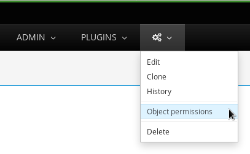

.. _admin:

Administration guide
====================

The **ADMIN** menu allows administrators to manage:

-  Group and user permissions
-  Bug tracking systems
-  and more ...

Kiwi TCMS admin interface is automatically generated by Django and allows the
user to add, edit and delete records in the database.

|The Administration screen|

.. _configure-bug-trackers:

Configure external bug trackers
-------------------------------

One of the first steps when working with Kiwi TCMS is to configure bug
tracking systems. This can be done via the interface located at
``ADMIN -> Everything else -> Test cases -> Bug trackers``.
Each bug tracker is given a name, URL, API credentials and integration type.
The extent of integration with 3rd party bug tracking systems is documented
in :mod:`tcms.issuetracker`.

.. important::

    External bug tracker integration classes are defined as a dotted path list
    in the ``EXTERNAL_BUG_TRACKERS`` setting, see :ref:`configuration`.
    Plugins and Kiwi TCMS admins may override this setting to provide more
    control and customized integration.

    .. versionadded:: 8.5

.. important::

    Details on what each field means can be found at
    :class:`tcms.testcases.models.BugSystem`. Integration details for supported
    bug trackers can be found at :mod:`tcms.issuetracker.types`! Please read
    these sections carefully before configuring integration with external bug tracking
    systems!

.. important::

    Kiwi TCMS comes with its own internal bug tracker. This is designed as
    a light-weight solution for small teams. In case you are already using an
    external defect tracking system like Bugzilla you may disable the internal
    one by defining ``KIWI_DISABLE_BUGTRACKER=yes`` in your environment
    variables!

    .. versionadded:: 8.4

.. _managing-permissions:

Managing permissions
--------------------

The Authentication and authorization section covers Groups, Users and
permissions.

|The Auth screen|

.. important::

    Permissions are usually assigned on groups but they can be granted on
    individual users too! It is recommended to use groups for permissions
    management.

.. important::

    The standard User and Group permissions are unbound, in other words not
    related to individual records in the database. They are used to control
    access to types of resources, e.g. "Can view bug", "Can delete test case"!
    For object-level permissions see below!

.. warning::

    Kiwi TCMS requires the ``auth.view_user`` permission in order to display
    read-only information on user profile pages! This permission is
    not granted by default because the profile page contains personal
    information like names and email address.

    Administrators can grant this
    on individual or group level if access to such information is considered
    acceptable.

    .. versionadded:: 8.6

Groups
~~~~~~

Kiwi TCMS uses groups to manage access to parts of the system. Groups
have two fields: name and permissions. By default there are two groups
created

* Administrator - has all available permissions;
* Tester - has ``add``, ``change``, ``delete`` and ``view`` permissions from
  the ``attachments``, ``bugs``, ``django_comments``, ``linkreference``,
  ``management``, ``testcases``, ``testplans`` and ``testruns`` applications.
  These are the permissions required for normal usage of Kiwi TCMS!

.. important::

    *Tester* is the default group to which new user accounts are assigned!
    This can be controlled with the ``DEFAULT_GROUPS``,
    see :ref:`configuration`.

Adding a group
^^^^^^^^^^^^^^

A group requires a name and a set of permissions. To add a group:

#. From the **ADMIN** menu, click **Users and groups**.

   |The Admin menu 1|

#. Click **Groups**, then click **Add Group**.

   |The Add group link|

#. In the add group screen, perform the following actions:

   -  Enter the **Name** for the group.
   -  From **Available permissions**, select the Group's permissions.

#. Click **Add**.

   |The Add Group button|

   The **Chosen permissions** list is updated.
#. Click **Save**.

Editing a group
^^^^^^^^^^^^^^^

The group name can be changed. Permissions can be added or removed.
To edit a group:

#. From the **ADMIN** menu, click **Users and groups**.
#. Click **Groups**.
#. From the Group list, click the group to edit.
#. Select the permission required. Click **Add** or **Remove** as
   required.
#. Click **Save**.

Users
~~~~~

Staff status
^^^^^^^^^^^^

A user with *Staff status* can access the Admin panel. This is required
for normal Kiwi TCMS usage because many records can only be manipulated via
admin pages! Upon account creation the *is_staff* flag is automatically
granted and the user is assigned to ``DEFAULT_GROUPS``.

To assign *Staff status*:

#. From the **ADMIN** menu, click **Users and groups**.
#. Click **Users**.
#. In the **Search Bar**, enter the username, and then click **Search**.
#. Click the **Username**.
#. In the **Permissions** screen, select **Staff status**.

   |The Staff Status check box|

#. Click **Save**. The **Staff Status** icon changes to a green tick.

.. note::

  If the user requires full permissions, select **Superuser status**.

Adding a user to a group
^^^^^^^^^^^^^^^^^^^^^^^^

To add a user to a group:

#. From the **ADMIN** menu, click **Users and groups**.
#. Click **Users**.
#. In the **Search Bar**, enter the username, and then click **Search**.
#. Click the **Username**.
#. From **Groups** select the user to add.
#. Click **Save**.

Updating personal information
^^^^^^^^^^^^^^^^^^^^^^^^^^^^^

Kiwi TCMS can store email, first and last name details of a user.
To update personal information:

#. From the **ADMIN** menu, click **Users and groups**.
#. Click **Users**.
#. In the **Search Bar**, enter the username, and then click **Search**.
#. Click the **Username**.
#. From **Personal Information** edit:

   -  First Name
   -  Last Name
   -  Email Address

#. Click **Save**.

Deleting a user
^^^^^^^^^^^^^^^

.. danger::

    Users can be deleted from Kiwi TCMS however this will remove all database
    records connected to this user. A user that is no longer required
    must be disabled instead!

To disable a user:

#. From the **ADMIN** menu, click **Users and groups**.
#. Click **Users**.
#. In the **Search Bar**, enter the username, and then click **Search**.
#. Click the **Username**.
#. Untick the **Active** checkbox.

   |The Active checkbox|

#. Click **Save**.

Object-level permissions
~~~~~~~~~~~~~~~~~~~~~~~~

.. versionadded:: 8.8

Object-level permissions are bound to a particular record in the database.
They are used to control access to specific objects, e.g.
“Can view bug 919”, “Can delete test case 2029”! This section describes how
object-level permissions are used in Kiwi TCMS and their limitations.

    |Object Permissions Menu|

- The following HTML pages honor object-level permissions:

  - Bug page
  - TestCase page
  - TestPlan page
  - TestRun page

- Unlike HTML pages most API methods represent bulk operations
  and don't support the notion of a single record. Object-level
  permissions are not honored by the API layer
- Unbound permissions always supersede object-level permissions.
  You can't use object-level permissions to prevent access
- Available permission labels are related to the current object type, e.g.
  when editing object-level permissions for Bug-919 you can only assign
  permissions related to bugs
- Assignning ``add`` permission doesn't make sense here because creating
  new objects is related to their type, not the individual object
- ``view`` allows per-object access with the limitation that HTML pages
  use API calls to render related information!
  Some parts of the page will not be rendered
- ``change`` permission will not allow modification of many-to-many properties
  such as tags, components, comments, attachments because these are controlled
  via separate types of permissions to allow more granularity to admins
- ``view`` + ``change`` allows access to object history because the history
  admin allows you to revert to older versions
- ``delete`` will allow to cascade-delete all related objects even if
  the user doesn't have explicit permissions granted for them
- A record with username ``AnonymousUser`` also exists

Example of more granular permission organization
~~~~~~~~~~~~~~~~~~~~~~~~~~~~~~~~~~~~~~~~~~~~~~~~

By default Kiwi TCMS comes with 2 groups that either contain all available
permissions or just the ones required by all parts of the application. This
section describes a more granular approach.

Leave the *Administrator* and *Tester* groups intact and create new ones!

Need-to-know level
^^^^^^^^^^^^^^^^^^

- Create a *Need-to-know* group without any permissions and assign users to it.
  You can make this the ``DEFAULT_GROUPS`` setting.
- Don't assign permissions to individual users
- Grant object-level permissions on each user that needs access to particular
  object!

Users will be able to login into Kiwi TCMS and see their dashboard and will
have direct access to records on which they have been granted
object-permissions but nothing else. View and change capabilities will be
limited.

Read-only level
^^^^^^^^^^^^^^^

- Create a *Read-Only* group and assign only ``view`` permissions to it
- Will also work with users who are not members of any groups

Users will be able to login into Kiwi TCMS, search and view pages according
to the permissions granted. If you grant all permissions of type ``view``
then the user should be able to see everything in Kiwi TCMS.

Moderator/Manager level
^^^^^^^^^^^^^^^^^^^^^^^

- Create a group and assign ``add``, ``delete`` permissions
- Objects of types Products, Versions, Builds, etc. are controlled via the
  ``management`` application while other apps control a few more objects like
  statuses and types. These can be seen in the *Admin panel* page

You will assign users to this group if they are trusted enough to be able to
create and moderate objects.

Tester level
^^^^^^^^^^^^

Depending on your process organization you may want to only grant certain
permissions for the ``attachments``, ``bugs``, ``django_comments``,
``testcases``, ``testplans`` and ``testruns`` applications. Here a mix of
``view``, ``change`` and ``add`` will allow group members to test & provide
execution results but not delete records. Pay attention to permissions for
many-to-many relationships like tags, components, etc which may be used
to control specific parts of a page.

Mix & match
^^^^^^^^^^^

Kiwi TCMS will evaluate all individual, group and object-level permissions
when checking for access. It is possible to create a very granular list of
groups and then assign users to various groups depending on what level of
access you want to provide for them!

.. _explanation-of-entities:

Explanation of editable entities
--------------------------------

Some DB entities are editable via the Admin interface. Their meaning is
explained below.

Products
~~~~~~~~

All testing is based around products made by the organization.

Product Classifications
~~~~~~~~~~~~~~~~~~~~~~~

A Classification is a title used to group products of a similar nature.
For example: Mobile apps, Desktop apps, etc.

Builds and Versions
~~~~~~~~~~~~~~~~~~~

The entity Build describes a product build used for testing. Depending on
your versioning scheme and release workflow this entity may be used or not!

For example there could be an upcoming product version tagged "3.1" with
several daily builds (aka smaller versions) until you are
satisfied with the quality of the product before "3.1" released.

On the other hand if you release often in small increments product Version
is likely the only numbering scheme that you will use.
Each product in Kiwi TCMS needs a version. Many products will have
multiple versions. For example, Firefox 3.0.14, 3.5.3.

Kiwi TCMS allows both
Build and Version to be specified when testing. If you don't use builds we
advise you either to leave as "undefined" or use the same value as for the
version being tested.

Tags
~~~~

Kiwi TCMS uses tags to assign additional meta-data during testing. Tags can
be assigned to TestPlan, TestCase and TestRun objects. The following
permissions are taken into account:

- ``management.add_tag`` - if missing users will not be able to auto-create
  tags and are instead forced to use pre-existing ones. Inside the web UI
  autocomplete widgets help figure out what is available. This is useful in
  organizations where freely creating tags is not allowed! Also controls
  adding new objects via admin panel.
  ``management.delete_tag`` - controls deleting tags from the database via
  admin panel
- ``test{case|run|plan}.{add|delete}_test{case|run|plan}tag`` - control if
  user can assign or remove tags to test case, test run or test plan objects
  respectively.

Components
~~~~~~~~~~

A product is broken down into components. For example, two components of
Kiwi TCMS are the web interface and the RPC API service. Components may be used
to classify test cases that are related to particular area under test.

Priorities
~~~~~~~~~~

Test cases can be assigned a priority. The priority designation may be used
to organize your testing workflow and does not have special meaning inside
Kiwi TCMS.

Test Plan types
~~~~~~~~~~~~~~~

A Test Plan type is used to describe the test being performed. For
example, acceptance or smoke testing, functional testing, etc.

Test Case categories
~~~~~~~~~~~~~~~~~~~~

A test case category may be used to further describe the type of test being
performed or convey additional information about the test case. Similar
information may also be conveyed with tags, properties or in other way
so it is up to you to decide how you want to organize your testing workflow!

Test Execution statuses
~~~~~~~~~~~~~~~~~~~~~~~

.. versionadded:: 8.0

As shown in :ref:`data_organization_kiwitcms` TestExecution objects record
the status for each TestCase tied to a particular TestRun.
Kiwi TCMS installs several pre-configured statuses by default. Starting with
v8.0 you can fully customize them!

For this purpose the following fields are available:

- **Name** - human readable status name

  .. note::

      For statuses shipped with Kiwi TCMS the names may appear translated
      into local language! If you change these default names they will
      appear untranslated!

      Translation of non-default names is currently not straight forward,
      see https://github.com/ecometrica/django-vinaigrette/issues/45.

- **Color** - a color to be used for icons, charts, etc.

  .. note::

      For a consistent user experience we recommend using colors of the same family
      (or even the same color) for the various weight categories - green
      for *Positive*, black/gray for *Neutral* and red for *Negative*!

- **Icon** - a CSS class to be used for visual display. The accepted
  value is any valid class name from
  `Font Awesome v4.7 <https://fontawesome.com/v4.7.0/icons/>`_ or
  `Patternfly v3.0 <https://www.patternfly.org/v3/styles/icons/index.html>`_

  .. note::

      Icons must be specified with their full CSS class name. For example
      ``PASSED`` is ``fa fa-check-circle-o``!

- **Weight** - integer representation of this status

  .. note::

      Kiwi TCMS recognizes only 3 weight categories:

      - *Positive* - ``PASSED`` and ``WAIVED`` - test completed and was
        successfull or was skipped/ignored on purpose
      - *Neutral* - ``IDLE``, ``PAUSED`` and ``RUNNING`` - test has
        not been executed yet and the result is unknown
      - *Negative* - ``BLOCKED``, ``ERROR`` and ``FAILED`` - test completed
        unsuccessfully or was not able to complete due to external factors

      Kiwi TCMS does not make any other distinction based on weight except
      when sorting statuses for display (e.g. a row of buttons)! It is up to you
      to define what each individual status means.

  .. warning::

      Make sure to always have at least 1 positive, 1 negative and 1 nautral
      status, e.g. ``PASSED``, ``IDLE``, ``FAILED``. If you delete all statuses
      within a certain weight group Kiwi TCMS will crash!

.. |The Administration screen| image:: ./_static/Admin_Home.png
.. |The Auth screen| image:: ./_static/Auth_Home.png
.. |The Admin menu 1| image:: ./_static/Click_Auth.png

.. |The Add Group button| image:: ./_static/Group_Add.png
.. |The Staff Status check box| image:: ./_static/Select_Staff_Status.png
.. |The Active checkbox| image:: ./_static/Disable_User.png

