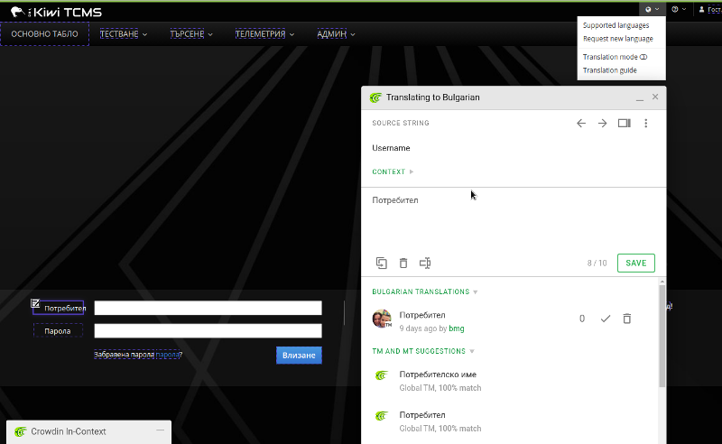

.. _contribution:

Contribute
==========

Kiwi TCMS team welcomes and appreciates any kind of contribution from you in
order to make Kiwi TCMS better and better. Anyone who is interested in
Kiwi TCMS is able to contribute in various areas, whatever you are a good
and experienced developer, documentation writer or even a regular user.

.. include:: set_dev_env.rst
    :start-line: 2

Testing
-------

Automated test suite can be executed with the ``make check`` command. The
following syntax is supported::

        make check (uses SQlite)
        TEST_DB=MySQL make check
        TEST_DB=MariaDB make check
        TEST_DB=Postgres make check
        TEST_DB=all make check (will test on all DBs)

.. note::

    If you want to execute testing against different DB engines on your local
    development environment make sure the respective DB engines are installed
    and configured! ``make check`` uses the configuration files under
    ``tcms/settings/test/``. Make sure to edit them if necessary!

Security Issues
---------------

If you think that an issue with Kiwi TCMS may have security implications,
please do not publically report it in the bug tracker. Instead ping us via
email to coordinate the fix and disclosure of the issue!

Reporting General Issues
------------------------

If you have any good idea, or catch a bug, please do
create an issue at https://github.com/kiwitcms/Kiwi/issues!

Documentation
-------------

Documentation has been provided along with the source code within the ``docs/``
directory and is built using Sphinx. All content is written in
reStructuredText format. To build the docs::

    $ cd docs/
    $ make html

Translation
-----------

Kiwi TCMS is using Crowdin as our translation service. You can find the project
at https://crowdin.com/project/kiwitcms. You need to register with Crowdin before
you can work on any translations!

To translate the application first turn on the special *translation mode* in
Kiwi TCMS via the language menu (top-right corner). Then use Crowdin in-context
editor to update the strings. The actual content on the page wil be updated on
the fly as you type! Don't forget to **Save** the newly submitted translation.
*kiwitcms-bot* will take care to submit the new strings as GitHub pull request!

|Crowdin in-context|

.. versionadded:: 7.0

.. warning::

    If in-context editor doesn't show source string your browser may not be supported!
    Try updating the browser or switching to a different one! In our experience
    Firefox 60.8.0 did not work but Google Chrome 77.0.3865.75 works!

.. important::

    If possible start Kiwi TCMS in development mode (see above), using the latest version
    from the *master* branch and translate from there. If you are unsure how to
    do this then use the in-context editor at https://public.tenant.kiwitcms.org!

To request a new language please
`create an issue <https://github.com/kiwitcms/Kiwi/issues/new?title=Request+new+language:+...&body=Please+enable+...+language+in+Crowdin>`_
on GitHub.

If you prefer translating out of context (not recommended) please read the
`Starting Translation how-to
<https://support.crowdin.com/joining-translation-project/#starting-translation>`_
and the `Online Editor guide <https://support.crowdin.com/online-editor/>`_.

Making strings translatable
~~~~~~~~~~~~~~~~~~~~~~~~~~~

Before strings can be translated they need to be marked as translatable.
This is done with the ``gettext_lazy()`` function or its shortcut ``_()``.
For templates ```` at the top of the template and then use
the ```` template tag to mark strings as translatable!
Please read `Django's Translation documentation
<https://docs.djangoproject.com/en/2.2/topics/i18n/translation/>`_ if
you are not sure what these functions are!

.. warning::

    To update .po files once translatable strings have been changed or updated
    you have to execute the following command and commit the results in git::

        make messages

    At the moment there is no test for this because Django doesn't make it easier
    to implement a quick test based on 'git status'!

