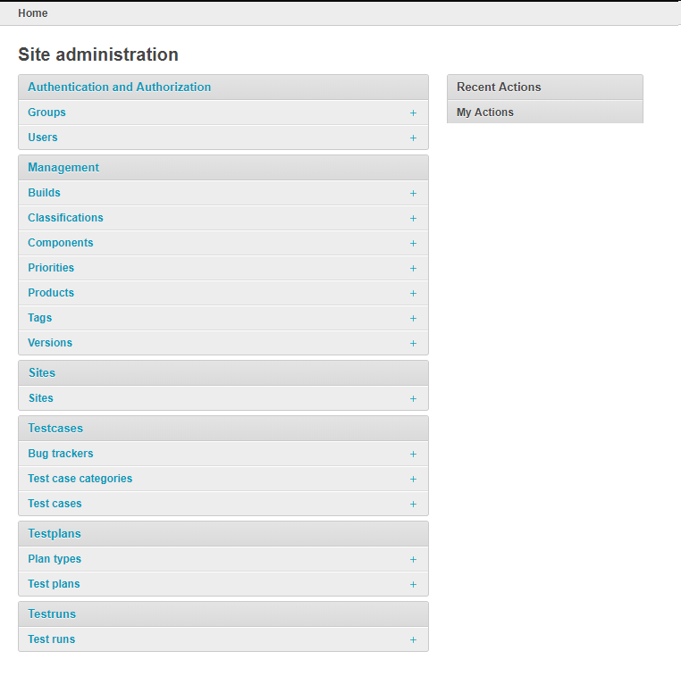
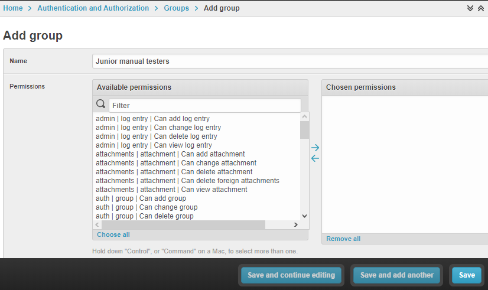

.. _admin:

Administration
==============

The TCMS Administration tab allows administrators to manage:

-  Group and user permissions
-  Entities
-  Test Plans and Test Cases.

|The Administration screen|

Managing permissions
--------------------

The Auth administration section covers Groups and Users.

|The Auth screen|

Groups
~~~~~~

The TCMS uses groups to manage access to parts of the system. Groups
have two fields: name and permissions.

Adding a group
^^^^^^^^^^^^^^

A group requires a name and a set of permissions.

Procedure: Adding a group
'''''''''''''''''''''''''

To add a group:

#. From the **ADMIN** menu, click **Auth**.

   |The Admin menu 1|

#. Click **Groups**, then click **Add Group**.

   |The Add group link|

#. In the add group screen, perform the following actions:

   -  Enter the **Group Name**.
   -  From **Available permissions**, select the Group's permissions.

#. Click **Add**.

   |The Add Group button|

   The **Chosen permissions** list is updated.
#. Click **Save**.

Editing a group
^^^^^^^^^^^^^^^

The group name can be changed. Permissions can be added or removed.

Procedure: Editing a group
''''''''''''''''''''''''''

To edit a group:

#. From the **ADMIN** menu, click **Auth**.
#. Click **Groups**.
#. From the Group list, click the group to edit.
#. Select the permission required. Click **Add** or **Remove** as
   required.
#. Click **Save**.

Users
~~~~~

Assigning administrator rights
^^^^^^^^^^^^^^^^^^^^^^^^^^^^^^

A user with administrator rights can access the **ADMIN** tab.

Procedure: Assigning administrator rights
'''''''''''''''''''''''''''''''''''''''''

To assign administrator rights:

#. From the **ADMIN** menu, click **Auth**.
#. Click **Users**.
#. In the **Search Bar**, enter the username, and then click **Search**.
#. Click the **Username**.
#. In the **Permissions** screen, select **Staff status**.

   |The Staff Status check box|

#. Click **Save**. The **Staff Status** icon changes to a green tick.

.. note::

  If the user requires full permissions, select **Superuser status**.

Assigning permissions
^^^^^^^^^^^^^^^^^^^^^

User permissions can be granted or revoked for individual components of
the TCMS. For example, the ability to add attachments to a Test Case.

Procedure: Assigning permissions
''''''''''''''''''''''''''''''''

To assign permissions:

#. From the **ADMIN** menu, click **Auth**.
#. Click **Users**.
#. In the **Search Bar**, enter the username, and then click **Search**.
#. Click the **Username**.
#. In the **User permission** screen:

   -  To add permissions, select the permissions to be granted, and then
      click **Add**.
   -  To remove permissions, select the permissions to be revoked, and
      then click **Remove**.

#. Click **Save**.

Adding a user to a group
^^^^^^^^^^^^^^^^^^^^^^^^

Group permissions in the TCMS work the same as they do in Linux. The
system checks a user's personal permissions, then group permissions.

Procedure: Adding a user to a group
'''''''''''''''''''''''''''''''''''

To add a user to a group:

#. From the **ADMIN** menu, click **Auth**.
#. Click **Users**.
#. In the **Search Bar**, enter the username, and then click **Search**.
#. Click the **Username**.
#. From **Groups** select the user to add.
#. Click **Save**.

Updating personal information
^^^^^^^^^^^^^^^^^^^^^^^^^^^^^

The TCMS can store email, first and last name details of a user.

Procedure: Updating personal information
''''''''''''''''''''''''''''''''''''''''

To update personal information:

#. From the **ADMIN** menu, click **Auth**.
#. Click **Users**.
#. In the **Search Bar**, enter the username, and then click **Search**.
#. Click the **Username**.
#. From **Personal Information** edit:

   -  First Name
   -  Last Name
   -  Email Address

#. Click **Save**.

Deleting a user
^^^^^^^^^^^^^^^

Users can not be deleted from TCMS. A user that is no longer required
must be disabled.

Procedure: Disabling a user
'''''''''''''''''''''''''''

To disable a user:

#. From the **ADMIN** menu, click **Auth**.
#. Click **Users**.
#. In the **Search Bar**, enter the username, and then click **Search**.
#. Click the **Username**.
#. Untick the **Active** checkbox.

   |The Active checkbox|

#. Click **Save**.

Access Control Lists
~~~~~~~~~~~~~~~~~~~~

The TCMS uses ACLs for the user groups: Guest, Tester, and Admin. The
permissions for each group can be controlled from the **Group** section
in the **AUTH** tab.

**Default ACLs in the TCMS.**

+----------------+----------------+----------------+----------------+----------------+
| Group          | Test Plan      | Test Case      | Environment    | Administration |
+================+================+================+================+================+
| Guest          | Read           | Read           | -              | -              |
+----------------+----------------+----------------+----------------+----------------+
| Tester         | Read / Write   | Read / Write   | Read / Write   | -              |
+----------------+----------------+----------------+----------------+----------------+
| Administrator  | Read / Write   | Read / Write   | Read / Write   | Read / Write   |
+----------------+----------------+----------------+----------------+----------------+

Managing entities
-----------------

The following entities are listed in the TCMS:

-  Builds
-  Classifications
-  Components
-  Priorities
-  Products
-  Versions

|The Management screen|

Builds
~~~~~~

The entity build describes the operating system version (build) used for
Test Cases. This is particularly important to help ensure Test Cases are
repeatable.

Procedure: Adding a build
^^^^^^^^^^^^^^^^^^^^^^^^^

To add a build:

#. From the **ADMIN** menu, click **Management**.
#. Click **Builds**.
#. Click **Add build**.
#. In the **Add build** screen, perform the following actions:

   -  Enter **Name**.
   -  Select **Product**.
   -  Enter build **Description**.

   |The Add build screen|

#. Click **Save**.

Editing a build
^^^^^^^^^^^^^^^

The name, product, and is active fields can be edited.

Procedure: Editing a test build
'''''''''''''''''''''''''''''''

To edit a test build:

#. From the **ADMIN** menu, click **Management**.
#. Click **Test Build**.
#. Click the **ID** of the Test Build to be edited.
#. In the **Change Test Build** screen edit the following:

   -  Name
   -  Product
   -  Description
   -  Is active

#. Click **Save**.

Classifications
~~~~~~~~~~~~~~~

A classification is a title used to group products of a similar nature.
For example, Red Hat, Fedora, Internal Infrastructure.

Procedure: Adding a classification
^^^^^^^^^^^^^^^^^^^^^^^^^^^^^^^^^^

To add a classification:

#. From the **ADMIN** menu, click **Management**.

   |The Admin menu 2|

#. Click **Classifications**.
#. Click **Add classification**.
#. In the **Add classification** screen, perform the following actions:

   -  Enter the **Name**.
   -  Enter a **Description**.
   -  Enter the **Sortkey**.

   |The Add classification screen|

#. Click **Save**.

Editing a classification
^^^^^^^^^^^^^^^^^^^^^^^^

The name and description fields can be edited.

#. From the **ADMIN** menu, click **Management**.
#. Click **Classification**.
#. Click the **ID** of the classification to edit.
#. In the **Change classification** screen edit the following:

   -  Name
   -  Description
   -  Sortkey

#. Click **Save**.

Components
~~~~~~~~~~

A product is broken down into components. For example, two components of
RHEL 5 are glibc and gdm.

Procedure: Adding a component
^^^^^^^^^^^^^^^^^^^^^^^^^^^^^

To add a component:

#. From the **ADMIN** menu, click **Management**.
#. Click **Components**.
#. Click **Add component**.
#. In the **Add component** screen, perform the following actions:

   -  Enter the **Name**. 
   -  Select the **Product**.
   -  Select the **Initial owner**.
   -  Select the **Initial QA contact**.
   -  Enter the component **Description**.

   |The Add component screen|

#. Click **Save**. 

.. note::

  **Creating entries** To create the fields Product, Initial Owner, or
  Initial QA Contact, click the green plus icon.

Editing a component
^^^^^^^^^^^^^^^^^^^

The fields name, product, initial owner, QA contact, and description can
be edited.

Procedure: Editing a component
''''''''''''''''''''''''''''''

To edit a component:

#. From the **ADMIN** menu, click **Management**.
#. Click **Component**.
#. Click the **ID** of the component to be edited.
#. In the **Change component** screen edit the following:

   -  Name
   -  Product
   -  Initial Owner
   -  Initial QA contact
   -  Description

#. Click **Save**.

Priorities
~~~~~~~~~~

Test Cases can be assigned a priority.

Adding a priority
^^^^^^^^^^^^^^^^^

The priority field is alphanumeric.

Procedure: Adding a priority
''''''''''''''''''''''''''''

To add a priority:

#. From the **ADMIN** menu, click **Management**.
#. Click **Priorities**.
#. Click **Add priority**.
#. In the **Add priority** screen, perform the following actions:

   -  Enter the **Value**.
   -  Enter the **Sortkey**.
   -  Click **Is active**.

   |The Add priority screen|

#. Click **Save**.

Editing a priority
^^^^^^^^^^^^^^^^^^

All three attributes of a Priority can be edited.

Procedure: Editing a priority
'''''''''''''''''''''''''''''

To edit a priority:

#. From the **ADMIN** menu, click **Management**.
#. Click **Priorities**.
#. From the **Id** column, click the priority to edit.
#. In the **Change priorities** screen, edit the following:

   -  Value
   -  Sortkey
   -  Is active

#. Click **Save**.

Products
~~~~~~~~

All testing is based around the products made by Red Hat.

Procedure: Adding a product
^^^^^^^^^^^^^^^^^^^^^^^^^^^

To add a product:

#. From the **ADMIN** menu, click **Management**.
#. Click **Products**.
#. Click **Add product**.
#. In the **Add product** screen, perform the following actions:

   -  Enter the **Name**.
   -  Select the **Classification**.
   -  Enter the product **Description**.
   -  Click **Disallow New**.
   -  Select the **Votes Per User**.
   -  Enter the **Max Votes Per Bug**.
   -  Click **Votes To Confirm**.

   |The Add product screen|

#. Click **Save**.

Editing a product
^^^^^^^^^^^^^^^^^

The fields name, classification, description, disallow new and votes to
confirm can be edited.

Procedure: Editing a product
''''''''''''''''''''''''''''

To edit a product:

#. From the **ADMIN** menu, click **Management**.
#. Click **Products**.
#. Click the **ID** of the product to be edited.
#. In the **Change product** screen, edit the following:

   -  Name
   -  Classification
   -  Description
   -  Disallow New
   -  Votes To Confirm

#. Click **Save**.

Versions
~~~~~~~~

Each product in the TCMS needs a version. Many products will have
multiple versions. For example, Firefox 3.0.14, 3.5.3.

Procedure: Adding a version
^^^^^^^^^^^^^^^^^^^^^^^^^^^

To add a version:

#. From the **ADMIN** menu, click **Management**.
#. Click **Versions**.
#. Click **Add version**.
#. In the **Add version** screen, perform the following actions:

   -  Enter **Value**.
   -  Select **Product**.

   |The Add version screen|

#. Click **Save**.

Editing a version
^^^^^^^^^^^^^^^^^

The fields value, and product can be edited.

Procedure: Editing a version
''''''''''''''''''''''''''''

To edit a version:

#. From the **ADMIN** menu, click **Management**.
#. Click **Versions**.
#. Click the **ID** of the Version to be edited.
#. In the **Change version** screen, edit the following:

   -  Value
   -  Product

#. Click **Save**.

Managing Test Plans
-------------------

This section covers the administration of meta data relating to Test
Plans.

|The Test Plan management screen|

Test Plan types
~~~~~~~~~~~~~~~

A Test Plan type is used to describe the test being performed. For
example, acceptance or smoke.

Adding a Test Plan type
^^^^^^^^^^^^^^^^^^^^^^^

A new type needs a name, and description.

Procedure: Adding a Test Plan type
''''''''''''''''''''''''''''''''''

To add a Test Plan type:

#. From the **ADMIN** menu, click **Test Plans**.
#. Click **Test Plan Categories**.
#. Click **Add Test Plan Types**.
#. In the **Add test plan type** screen, perform the following actions:

   -  Enter the **Name**.
   -  Enter the type **Description**.

   |The Add test plan type screen|

#. Click **Save**.

Test plans
~~~~~~~~~~

This screen provides a list of all the test plans in TCMS. The **Add
test plan** link can be used to create a test plan. For more
information, see Creating a Test Plan.

Managing Test Cases
-------------------

This section covers the administration of meta data relating to Test
Cases.

|The Test Case management screen|

Test Case Bug Systems
~~~~~~~~~~~~~~~~~~~~~

The bug system for test cases is Red Hat Bugzilla. To view the details
click the **Test case bug systems**.

Test Case categories
~~~~~~~~~~~~~~~~~~~~

A category is used to describe the type of test being performed. For
example, regression or bug verification.

Adding a Test Case category
^^^^^^^^^^^^^^^^^^^^^^^^^^^

A new category needs a name, product and description.

Procedure: Adding a category
''''''''''''''''''''''''''''

To add a category:

#. From the **ADMIN** menu, click **Test Cases**.
#. Click **Test case categories**.
#. Click **Add Test Case Category**.
#. In the **Add test case category** screen, perform the following
   actions:

   -  Enter the **Name**.
   -  Select the **Product**.
   -  Enter the category **Description**.

   |The Add test case category screen|

#. Click **Save**.

Test cases
~~~~~~~~~~

This screen provides a list of all the test cases in TCMS. The **Add
test case** link can be used to create a test case. For more
information, see Creating a Test Case.

.. |The Auth screen| image:: ../_static/Auth_Home.png
.. |The Admin menu 1| image:: ../_static/Click_Auth.png
.. |The Add group link| image:: ../_static/Groups_Home.png

.. |The Staff Status check box| image:: ../_static/Select_Staff_Status.png
.. |The Active checkbox| image:: ../_static/Disable_User.png
.. |The Management screen| image:: ../_static/Mgmt_Home.png
.. |The Add build screen| image:: ../_static/Add_Test_Build.png
.. |The Admin menu 2| image:: ../_static/Click_Management.png
.. |The Add classification screen| image:: ../_static/Add_Classification.png
.. |The Add component screen| image:: ../_static/Add_Component.png
.. |The Add priority screen| image:: ../_static/Add_Priority.png
.. |The Add product screen| image:: ../_static/Add_Product.png
.. |The Add version screen| image:: ../_static/Add_Version.png
.. |The Test Plan management screen| image:: ../_static/TP_Home.png
.. |The Add test plan type screen| image:: ../_static/Add_TP_Type.png
.. |The Test Case management screen| image:: ../_static/TC_Home.png
.. |The Add test case category screen| image:: ../_static/Add_TC_Category.png
