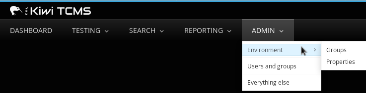
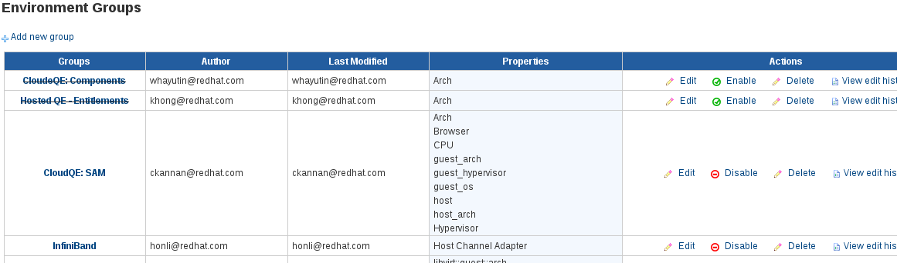
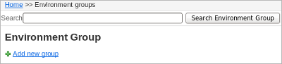
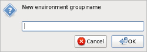
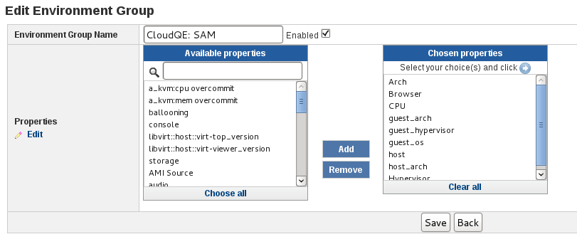
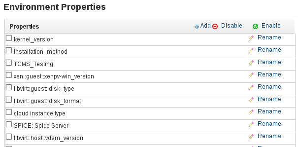
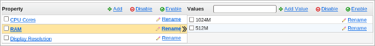

.. _environment:

Environment Variables
=====================

Kiwi TCMS uses environment variables to define the test setup. The
Environment Group is the top level container object, it contains one or
more Properties, each having a range of values. Properties can belong to
more than one group.

Environment Groups are assigned to Test Plans. Then when creating a Test Run
using the environment group and its properties youmay select on what hardware,
system software and other environmental background testing is executed.
You may also assign environment properties, which are not part of group, to
test runs directly via the test run page!

+------------+----------------+-------------------------+
| Group      | Property       | Value                   |
+============+================+=========================+
| Desktops   | Architecture   | i386, x86\_64, PPC      |
+------------+----------------+-------------------------+
|            | Memory (MB)    | 512, 1024, 2048, 4096   |
+------------+----------------+-------------------------+

Managing environment groups
---------------------------

A group is the container object in an environment. It allows a Test Plan
to be targeted to a specific set of testing conditions and hence provides greater
repeatability in testing.

Searching environment groups
~~~~~~~~~~~~~~~~~~~~~~~~~~~~

To search an environment group:

#. From the **Main menu** click **ADMIN::Environment::Groups**.

   |The Environment menu 1|

#. Enter the search parameters, and then click **Search Environment
   Group**.

   |image90|

Adding a new group
~~~~~~~~~~~~~~~~~~

Adding a group uses the **Environment Groups** screen shown above.

#. Click **Add New Group** button.

   |The Add New Group button|

#. Enter **Group Name**.

   |The Environment Group name screen|

#. In the **Edit Environment Group** screen, perform the following
   actions:

   -  Select **Enabled**.
   -  In the **Available Properties** box, select the property to add,
      and then click **Add**. Repeat this process to add more
      properties. 

   |The Environment Group Edit screen|

#. Click **Save** button.

.. note::

  To edit existing, or create new properties, click **Edit Properties**.

Editing an environment group
~~~~~~~~~~~~~~~~~~~~~~~~~~~~

An environment group can only be edited by authenticated users.

To edit an environment group:

#. Click **ENVIRONMENT**.
#. From the **Actions** column, click **Edit**.

   |The Edit link|

#. Edit the fields as required:

   -  Environment Group Name
   -  Enabled checkbox
   -  Properties list

#. Click **Save**.

Deleting a group
~~~~~~~~~~~~~~~~

A group that is no longer required must be disabled! 

.. warning::

    It is possible to delete environment groups but we discourage this
    practice. Django will delete all database records that are connected
    to this group!

Managing environment properties
-------------------------------

Environment properties and their associated values can be used in
multiple environment groups. Properties can also be assigned to Test Runs
to indicate under what conditions the testing was performed.

When creating values ensure that they are discrete measurable properties.
For example, screen resolution should be '1920x1200' rather than '24 inch widescreen'.

The **Environment Properties** screen provides the ability to edit,
create, enable, and disable properties.

-  From the **Main menu** click **ADMIN::Environment::Properties**.

   |The Environment menu 1|

-  To display a property's values, click on the property.

   |The Environment Properties screen|
 

.. note::

  Due to auditing requirements, environment properties and values cannot
  be deleted. To disable unused properties and values, click **Disable**.

Adding a property
~~~~~~~~~~~~~~~~~

To add an environment property:

#. From the **Environment Properties** screen click **Add**.

   |The Add button|

#. Enter the **New Property Name** ensuring that the property name is
   descriptive, and then click **Ok**.
#. Select the new property. The row containing the property will change its color.
#. In the **Values** text box, enter the property value. Click **Add
   Value**.

    |The Add Value button|

#. The new value is now displayed.

    |Property with new value|

Editing a Property
~~~~~~~~~~~~~~~~~~

To edit an environment property (see screenshots above):

#. Open **Environment Properties** screen.
#. Renaming:

   -  Click **Rename**.
   -  Enter the **New Property Name**, and then click **Ok**.

#. Edit values:

   -  Click on the property name to display its values.
   -  Enter the new **Value**, and then click **Ok**.

.. |The Edit link| image:: ../_static/Click_Edit.png

.. |The Add button| image:: ../_static/Click_Add.png
.. |The Add Value button| image:: ../_static/New_Values.png

