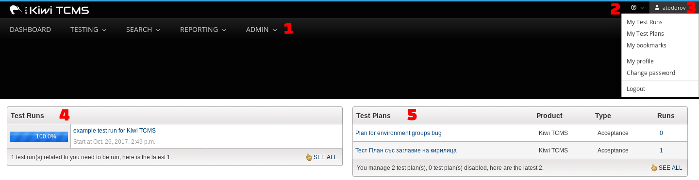
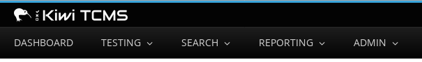
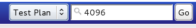

.. _introduction:

Introduction
============

"If it is not in the TCMS then we do not do it", and the converse: "If
we do it then it is in the TCMS".

The above motto has been the paradigm driving the development of the
TCMS. The development team has created a canonical source of information
about testing that is useful to both managers and QE Associates.

The TCMS provides:

-  Managers with a source of information on planning, cases and
   execution status.
-  Reproducibility across planning, cases and execution.
-  Audit traceability.
-  Increased productivity - Associates are able to identify and work on
   gaps in product coverage.

Getting to know the TCMS home page
----------------------------------

The home page is the principal section of the TCMS. It provides quick
access to assigned Test Runs and Test Plans. This section explains the
features accessible from the home page.

|The TCMS home page|

#. Menu bar
#. Bookmarks, Basic information and Recent tabs
#. Test Run list
#. Test Plan list
#. Quick and Advanced search
#. User Guide

**Menu bar**

The menu bar consists of six main menu items. When you hover over a menu
item, a sub-menu appears. The first item in the sub-menu is the default
page for the main menu item. To navigate to a previous screen, click on
the breadcrumb located below the menu bar.

|The TCMS menu bar and breadcrumbs|

-  **Home**
-  **Planning**

   -  Search Plans
   -  My Plans
   -  New Plan

-  **Testing**

   -  Search Runs
   -  Search Cases
   -  My Runs
   -  New Case

-  **Environment**

   -  Groups
   -  Properties

-  **Reporting**

   -  Overall
   -  Custom
   -  Testing Report

-  **Admin**

   -  Auth
   -  Management
   -  Test Plans
   -  Test Cases

-  **Quick Search**
-  **Advanced Search**

Bookmarks
~~~~~~~~~

Any page in TCMS can be bookmarked.

-  Click the **Bookmarks** tab from the **Home** to view your bookmarks.
-  Click **Bookmark this page** to add the current page to your
   bookmarks.

Basic information
~~~~~~~~~~~~~~~~~

TCMS stores basic user profile information. For example, email, IRC
nick, and contact details.

Procedure: Editing basic information
^^^^^^^^^^^^^^^^^^^^^^^^^^^^^^^^^^^^

#. From the Home screen, click **Basic information**.
#. Edit the required fields.
#. Click **Save Change**.

Test Runs
~~~~~~~~~

The home screen contains a list of Test Runs associated with the user
and a graphical display showing completion status. To access a Test
Plan, click the Test Run's name.

Test Plans
~~~~~~~~~~

The home screen contains a list of Test Plans associated with the user.
To access a Test Plan, click the Test Plan's name.

Quick Search
~~~~~~~~~~~~

Quick search allows direct access to a Test Plan, Test Case, or Test Run
via drop-down. To access a Test Plan, Test Case, or Test Run, enter the
ID number, and then click **Go**.

|A quick search example|

Footer
~~~~~~

The footer provides links to TCMS related topics:

-  Contact developers. Email the TCMS mailing list.
-  Request permissions. Ask for extra rights in TCMS.
-  Report bug. Help build a better TCMS.
-  User Guide.
-  Satisfaction survey. Provide feedback to the development team.
-  Release schedule. Upcoming releases.
-  XML-RPC service. API document.

