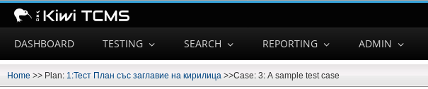

.. _introduction:

Introduction
============

"If it is not in the TCMS then we do not do it", and the converse: "If
we do it then it is in the TCMS".

The above motto has been the paradigm driving the development of Kiwi TCMS.
The development team has created a canonical source of information
about testing that is useful to both managers and QE Associates.

Kiwi TCMS provides:

-  Managers with a source of information on planning, cases and
   execution status.
-  Reproducibility across planning, cases and execution.
-  Audit traceability.
-  Increased productivity - Associates are able to identify and work on
   gaps in product coverage.

Getting to know the TCMS home page
----------------------------------

The home page is the principal section of the TCMS. It provides quick
access to assigned Test Runs and Test Plans. This section explains the
features accessible from the home page.

|The TCMS home page|

#. Navigation bar
#. Help menu
#. Personal menu
#. Your Test Run dashboard
#. Your Test Plan dashboard

**Navigation bar**

The navigation bar consists of the Main menu, Help menu and Personal menu.
When you click over a menu item, a sub-menu appears. To navigate to a previous screen, click on
the breadcrumb located below the menu bar.

|The TCMS menu bar and breadcrumbs|

Bookmarks
~~~~~~~~~

Any page in Kiwi TCMS can be bookmarked.

-  Click the **My bookmarks** item from the **Personal menu** to view your bookmarks.
-  Click **Bookmark this page** icon to add the current page to your bookmarks.

.. note::

    Kiwi TCMS is transitioning to a a new UI which conflicts with the existing jQuery
    versions. Because of this the navigation bar is loaded via an iframe and the
    **Bookark this page** button is disabled. It will be located to the left of the
    **Help menu** once re-enabled!

Personal dashboard
~~~~~~~~~~~~~~~~~~~

The home screen contains a list of Test Runs associated with the user
and a graphical display showing their completion status. To access a 
Test Run, click on its name.

The home screen also contains a list of Test Plans associated with the user.
To access a Test Plan, click on its name.

Help menu
~~~~~~~~~

The **Help menu** provides additional links to help pages:

- Report an issue with Kiwi TCMS
- User guide
- Administration guide
- XML-RPC service API document
- Kiwi TCMS version

.. note::

    The items in the Help menu are configurable via the ``HELP_MENU_ITEMS``
    setting in ``product.py``.

.. |The TCMS home page| image:: ../_static/Home_Screen.png

