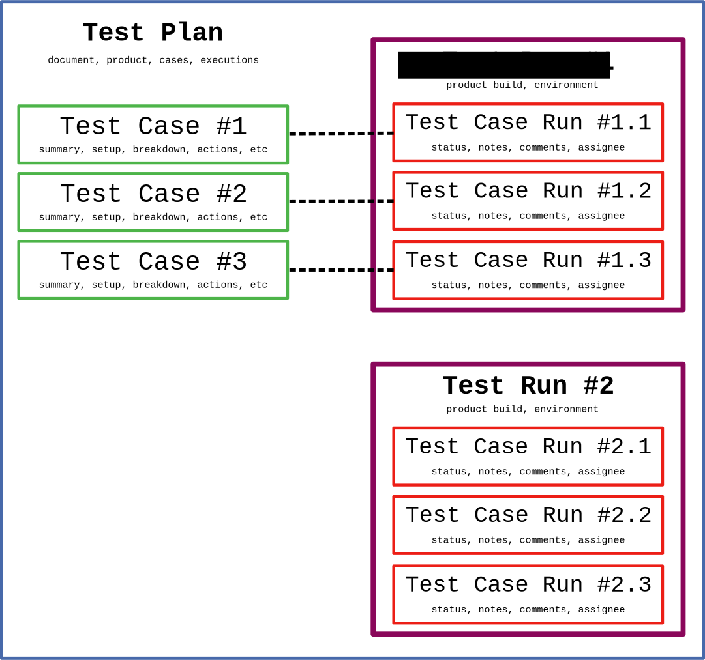

.. _introduction:

Introduction
============

"If it is not in the TCMS then we do not do it", and the converse: "If
we do it then it is in the TCMS".

The above motto has been the paradigm driving the development of Kiwi TCMS.
The development team has created a canonical source of information
about testing that is useful to both managers and QE Associates.

Kiwi TCMS provides:

-  Managers with a source of information on planning, cases and
   execution status.
-  Reproducibility across planning, cases and execution.
-  Audit traceability.
-  Increased productivity - Associates are able to identify and work on
   gaps in product coverage.

.. _data_organization_kiwitcms:

Data organization within Kiwi TCMS
----------------------------------

In order to successfully model your testing workflow with Kiwi TCMS you need to
understand how internal data structures relate to one another. The image below
represents a high level overview. More information can be found in section
:ref:`db`.

|Models relations|

A Test Plan is a high-level container object which is used to describe
testing activities. The most important scalar properties are the
document text and the product which is being tested. The most important
aggregate properties are the list of test cases and test runs
(aka test executions).

A Test Case describes how to perform a specific scenario.
This object is used to record scenarios in the database.

For every distinct product build that is being tested you have to create
a Test Run artifact. The Test Run holds a collection of Test Execution objects,
who the default tester is, start/finish timestamps, etc.

A Test Execution object is the container that links together the actual
testing scenario with its execution status, additional comments and bugs
found during testing! A Test Execution object has a 1-to-1 relation to the
Test Case for which it holds status. Thus a Test Execution object represents
the actual Test Case that will be/was executed against a particular product
build!

Explanation of additional data entities
---------------------------------------

In order to fully understand how Kiwi TCMS works and how it can be tailored to
various testing workflows you need to be familiar with the different data
entities within Kiwi. For more information please read
:ref:`explanation-of-entities`.

Testing workflow example
------------------------

Based on the information above we propose the following way to organize testing
activities within your team:

#. Create Test Plan for individual areas you'd like to test, for example
   *performance testing* or *cross-browser testing*;
#. Add all necessary Test Cases to your Test Plan;
#. When a new product build is available:

   - Create Test Run for that build including the Test Cases that need to be
     executed.
   - If you don't want to execute all Test Cases you can leave their status
     as IDLE or remove them from the Test Run!
   - In case you test in multiple environments then create a Test Run for each
     environment/build combination. Annotate the Test Run with tags to be able
     to search for it later!
   - QA engineers will execute the Test Runs and update statuses as
     appropriate.

**Question:** How do I show all executions for a given Test Case?

**Answer:** Open the Test Case view, click **Executions** card and expand the
widget. All executions from all Test Plans are shown.

**Question:** When did a Test Case started to fail?

**Answer:** Navigate to the page which shows all executions of that test case
as instructed above. Find the failing result. Here you have timestamp
information and link to the Test Run (with possible product build)
which recorded the failure.

**Question:** How do I show all test executions for a particular
Product/Plan/Build ?

**Answer:** Navigate to **Search::Search Test Runs** and filter Test Runs by
desired properties.If you want to filter runs from a particular Test Plan make
sure to specify the plan name in the **Plan** field. You can also filter Test
Runs by tags if necessary.

**Question:** Is this the first time that Test Case is failing on envrionment
X/Y/Z ?

**Answer 1:** Open **Executions** card for that particular Test Case and
examine the results by hand.

**Answer 2:** Perform the search described above and use the product version
to answer this question. This is the preferred way to do this!

**Answer 3:** Go to REPORTING -> Testing report, select product/versions and
select the ``By Plan & Build Per Plan View option``. You can see your Test
Plans with Runs grouped by builds and an execution status table on the right
of each Test Run.
**WARNING:** This is not recommended because the reporting views query the
entire database and are very inefficient at the moment!

Getting to know the TCMS home page
----------------------------------

The home page is the principal section of the TCMS. It provides quick
access to assigned Test Runs and Test Plans. This section explains the
features accessible from the home page.

|The TCMS home page|

#. Navigation bar
#. Help menu
#. Personal menu
#. Your Test Run dashboard
#. Your Test Plan dashboard

**Navigation bar**

The navigation bar consists of the Main menu, Help menu and Personal menu.
When you click over a menu item, a sub-menu appears.

|The TCMS menu bar|

Personal dashboard
~~~~~~~~~~~~~~~~~~~

The home screen contains a list of Test Runs associated with the user
and a graphical display showing their completion status. To access a
Test Run, click on its name.

The home screen also contains a list of Test Plans associated with the user.
To access a Test Plan, click on its name.

Help menu
~~~~~~~~~

The **Help menu** provides additional links to help pages:

- Report an issue with Kiwi TCMS
- User guide
- Administration guide
- XML-RPC service API document
- Kiwi TCMS version

.. note::

    The items in the Help menu are configurable via the ``HELP_MENU_ITEMS``
    setting in ``product.py``.

.. |The TCMS home page| image:: ../_static/Home_Screen.png
.. |The TCMS menu bar| image:: ../_static/Navigation_Tabs.png
