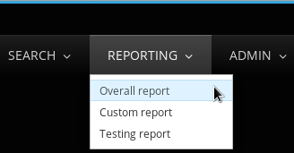
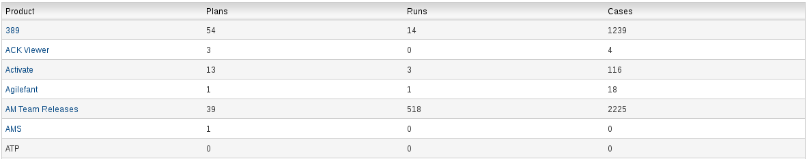
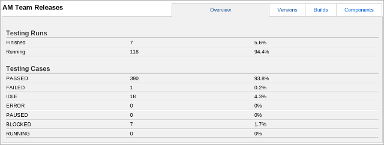
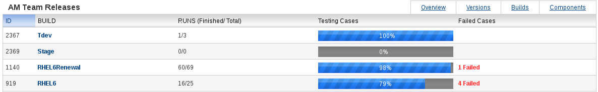
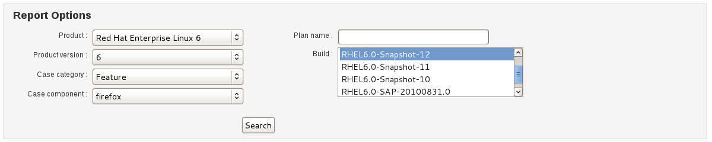
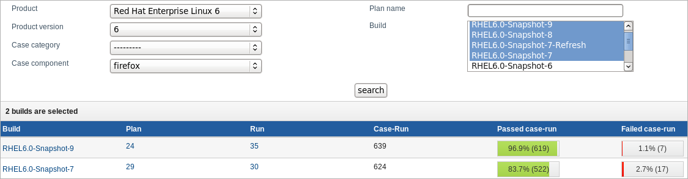
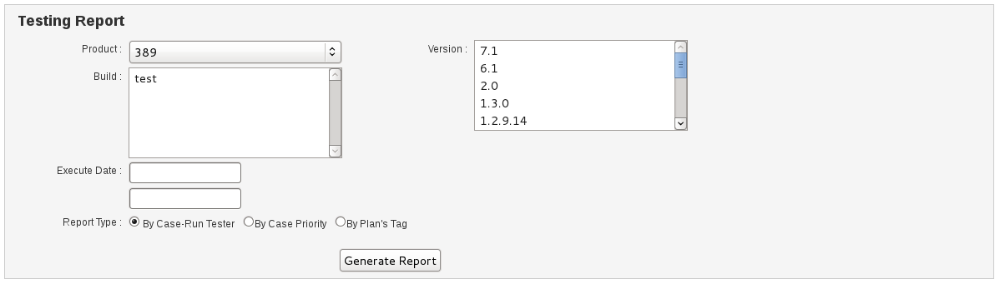

.. _report:

Reports
=======

This chapter explains how to generate reports in Kiwi TCMS.

Reports by Product and Version
------------------------------

TCMS can generate a list of Test Plans, Cases and Runs by product,
version, component, and build. To view a product report:

#. From the **Main menu** click **REPORTING::Overall report**.

   |The Reporting button 1|

#. Click the **Product Name**.

   |The product selection screen.|

   The product overview is displayed.

   |The product overview screen.|

#. Click **Versions** to view the report sorted on product version.

   |The product version screen.|

#. Click **Builds** to view the report sorted on product builds.

   |The product build screen.|

#. Click **Components** to view the report sorted on product components.

Custom Reports
--------------

Kiwi TCMS can generate a custom report based on search conditions.

#. From the **Main menu** click **REPORTING::Custom report**.
#. Enter the search details:

   -  Product
   -  Product version
   -  Case category
   -  Case component
   -  Plan name
   -  Build

   |Search details. 1|

#. Click **Search**. The results are displayed.

   |Report Results.|

Testing Reports
---------------

Kiwi TCMS can generate testing reports based on search conditions:

#. From the **Main menu** click **REPORTING::Testing Report**.
#. Select the product from the drop down box and either 1 or a range of
   versions.

   |Search details. 2|

#. Click **Generate Report**. The results are displayed.
 
.. note::

  No additional information is required to generate the testing report but
  if you want to provide values for Execute Date and Report Type you will
  get more specific results.

.. |The product version screen.| image:: ../_static/Product_Versions.png

