.. _testcase:

Test Cases
==========

This chapter explains how to create, search, edit, and import, clone,
review, tag and remove Test Cases in the TCMS.

Test Case workflow
------------------

This section outlines the process for creating a Test Case in TCMS. Test
Cases can not be deleted, instead they have their **Active** status set
to false.

There are three ways to associate Test Cases with a Test Plan:

#. Create a new Test Case. For more information, see Creating a Test
   Case.
#. Add an existing Test Case. For more information, see Using an
   existing Test Case.
#. Import a Test Case (XML). For more information, see Importing a Test
   Case.

|Test Plan workflow|

Creating a Test Case
--------------------

This section explains the procedure for creating a Test Case. When
writing a Test Case, clear setup instructions help reduce the chance of
failure due to an incorrect environment. A clear set of actions with
measurable expected results ensures that the Test Case produces
consistent outcomes regardless of who runs it. Breakdown instructions
should be provided to ensure the machine is returned to its original
state. For more information see Appendix A Writing a Test Case.

Procedure: Creating a new Test Case
~~~~~~~~~~~~~~~~~~~~~~~~~~~~~~~~~~~

To create a new Test Case:

#. Select a Test Plan, click **Cases**.
#. Hover over **Cases**, then click on **Write new case**.

   |The Write New Case button|

#. In the add new case screen, perform the following actions:

   -  Enter a **Summary**. This will appear in search results. It must
      be informative and concise.
   -  Select the **Product**. The product of the component being tested.
   -  Select the **Component**. The part of a product being tested. For
      example Firefox is a component of the product RHEL 5. TCMS
      supports multiple components for one Test Case.
   -  Select the **Category**. This is the type of test being run. For
      example, Regression, and Bug Verification.
   -  Select the **Automated** status: manual, auto, or autoproposed.
   -  Enter the **Requirement** (Legacy Testopia field).
   -  Enter **Script** (Legacy Testopia field).
   -  Enter **Alias**.
   -  Enter the **Default Tester**. Must be a valid email.
      This user will be notified by email when a Test Run is created.
   -  Select the **Estimated Time** to execute the Test Case. This is
      used as a guide when allocating resources.
   -  Select the **Priority**. This is a sliding scale, with P1 being
      the highest. Priority is used as a guide when allocating
      resources.
   -  Enter **Arguments**. Passed to an automated test script.
   -  Enter **Reference Link**. This is a user-specified field and can
      be a url to git, request tracker, Bugzilla or another reference.
   -  Enter **Tags** relevant to the test case.
   -  Enter **Notes**. Additional information about the Test Case.
   -  In the **Setup** text box, enter the setup instructions. Precise,
      clear setup instructions help produce repeatable test results.
   -  In the **Actions** text box, enter the steps to be performed.
      Write clear atomic actions (for example, browse to
      `www.github.com <http://www.github.com>`__), rather than vague
      statements (for example, browse the web).
   -  In the **Expected Results** text box, enter the measurable
      results. There should be a 1:1 correlation with the actions.
   -  In the **Breakdown** text box, enter the post test breakdown
      instructions. It is important that machines are returned to their
      original state following a Test Run.

   |The add new case screen|

#. Perform one of the following:

   -  To save and exit, click **Save**.
   -  To save and create another Test Case, click **Save and add
      another**.
   -  To cancel the process and return to the Test Plan screen, click
      **Back**.

Searching for Test Cases
------------------------

Test Cases can be searched using the following fields:

-  Case Summary
-  Author
-  Product
-  Plan
-  Priority
-  Automation status
-  Category
-  Status
-  Component
-  Bug ID
-  Tag

Procedure: Searching Test Cases
~~~~~~~~~~~~~~~~~~~~~~~~~~~~~~~

To search Test Cases:

#. From the **TESTING** menu, click **Search Cases**.

   |The Testing menu 1|

#. In the **Search Case** screen, enter the required search details.

   |The Search Case screen|

#. Click **Search**. The search results appear.

   |Test Case search results|

Advanced search
~~~~~~~~~~~~~~~

Advanced search accepts a combination of fields from Test Plan, Case,
and Run.

Procedure: Advanced Search
^^^^^^^^^^^^^^^^^^^^^^^^^^

To use advanced search for Test Plans, Cases and Runs:

#. In the search screen, click **Advanced Search**
#. Enter the required search terms.

   |The advanced search window.|

#. Click **Search Case**.

Editing a Test Case
-------------------

The Edit function modifies fields in a Test Case.

Procedure: Editing a Test Case
~~~~~~~~~~~~~~~~~~~~~~~~~~~~~~

To edit a Test Case:

#. Select the Test Case to be edited, and then click **Edit**.

   |The Edit button|

#. Edit the fields as required:

   -  Summary
   -  Default Tester
   -  Estimated Time
   -  Automated
   -  Requirement
   -  Script
   -  Alias
   -  Priority
   -  Status
   -  Arguments
   -  Reference Link
   -  Tags
   -  Notes
   -  Testing steps (setup, actions, results, break down).

#. Perform one of the following:

   -  To save and exit, click **Save**.
   -  To save and create another Test Case, click **Save and add another**.
   -  To cancel the process and return to the Test Plan screen, click **Back**.

.. note::

   To view the change log, click **Edit History**.

Procedure: Bulk edit of components
~~~~~~~~~~~~~~~~~~~~~~~~~~~~~~~~~~

TCMS supports the bulk edit of components of a Test Case through the
Test Plan interface.

#. Browse to the Test Plan containing the Test Cases to be edited.
#. Select the Test Cases to be edited.
#. Click **Component**.

   |The Component button 1|

#. Select the components, click **Add**.

   |The Component button 2|

   The Test Plan updates.

Procedure: Bulk add/remove of components
~~~~~~~~~~~~~~~~~~~~~~~~~~~~~~~~~~~~~~~~

TCMS supports the bulk add/remove of tags of Test Cases through the Test
Plan interface.

#. Browse to the Test Plan containing the Test cases to be edit.
#. Select the Test cases to be edited.
#. **To add a new tag:**

   -  From the Tag options click **Add**.

      |The Test cases tags options Add|

   -  A pop-up will appear, type the tag name and press **Submit**.
   -  Click **Submit**.

#. **To remove an existing tag:**

   -  From the Tag options click Remove.

      |The Test cases tags options Remove|

   -  Enter tag name. TCMS will prompt the user with existing tag names.

      |Tags remove list|

   -  Click **Submit**.

Using an existing Test Case
---------------------------

This section outlines the process for adding an existing Test Case to a
Test Plan. There are two ways to achieve this: from the Test Case, from
the Test Plan.

Procedure: Adding a Test Case from the Test Plan
~~~~~~~~~~~~~~~~~~~~~~~~~~~~~~~~~~~~~~~~~~~~~~~~

To add an existing Test Case from the Test Plan screen:

#. Select a Test Plan, click **Cases**.
#. Click **Case**, then click **Add cases from other plans**.

   |The Add cases from other plans button|

#. In the **Search Case** screen, enter the search criteria, and then
   click **Search**.
#. From the search results list, select the check box of the Test Cases
   to be added to the Test Plan.
#. Click **Add Selected Cases**.

   |Add Selected Cases|

Procedure: Adding a Test Plan to the Test Case
~~~~~~~~~~~~~~~~~~~~~~~~~~~~~~~~~~~~~~~~~~~~~~

To add a Test Plan from the Test Case screen:

#. Select a Test Case, and then click **Test Plans**.
#. In **Add into another Plan**, enter the Plan ID. Click **Add**.

   |The Test Plans tab|

#. Verify the Test Plan details are correct. Click **Submit**.

Importing a Test Case
---------------------

This section outlines the process for importing a Test Case into a Test
Plan. The Test Case must have been exported as XML from the existing
Testopia database. For more information, see Exporting a Test Plan.

Procedure: Importing a Test Case
~~~~~~~~~~~~~~~~~~~~~~~~~~~~~~~~

To import a Test Case, in the Test Plan screen:

#. Click **Cases**.
#. Hover over **Case**, then click **Import cases from XML**.

   |Import Cases from XML|

#. Click **Browse**.
#. Select the XML file to import, and then click **Open**.
#. Click **Import**.

   |The Import XML window|

XML format
~~~~~~~~~~

The XML file requires the following format:

#. DTD information (as per Testopia).
#. Testopia version.
#. Test case details:

   -  Tag meta data: author, priority, automated, status.
   -  Test Case summary
   -  Category Name
   -  Default Tester
   -  Name of Test Plan the Test Case was exported from.
   -  Actions to be performed.
   -  Expected Results to be measured.
   -  Setup steps to prepare the machine for the Test Case.
   -  Breakdown steps to return machine to original state.

Example: Sample XML file.
^^^^^^^^^^^^^^^^^^^^^^^^^
.. literalinclude:: ../_static/tcms_testcases.xml
   :language: xml

Cloning Test Cases
------------------

Test Cases can be cloned to multiple Test Plans:

Procedure: Cloning Test Cases
~~~~~~~~~~~~~~~~~~~~~~~~~~~~~

To clone a Test Case:

#. Browse to the Test Case.
#. Click **Clone**.

   |The Clone button 1|

#. Select the Test Plan for the cloned Test Cases. Use the filter to
   narrow search results:

   -  ID
   -  Product
   -  Product version
   -  Plan type
   -  Environment group
   -  Plan author
   -  Tag
   -  Plan summary
   -  Status (active)

   Click **Filter Plan**.

   |Test Plan filter details screen|

#. Click the Plans to clone this Test Case to.
#. Select **Case Properties**:

   -  Create a Copy - Unchecking will create a link to the selected Test
      Case.
   -  Keep original author - untick to make current user the author.
   -  Copy the component to new product - unchecking will remove
      component from the cloned Test Case.

#. Click **Clone**.

   |Clone Test Case details screen|

The new cloned Test Case is displayed.

.. note::

  The default clone settings will create an exact copy of the Test Case,
  and link it to the new Test Plan. Changes to the cloned Test Case will
  not affect the original version.

Changing Test Case status
-------------------------

The TCMS allows the user to change the status on one, selected or all
Test Cases.

Procedure: Changing Test Case status
~~~~~~~~~~~~~~~~~~~~~~~~~~~~~~~~~~~~

To change the Test Case status:

#. Select the Test Cases to be edited:

   -  Single Test Case - click the checkbox beside the sort ID.

      |A single Test Case selected|

   -  Multiple Test Cases - click the checkbox beside each sort ID.

      |Multiple Test Cases selected|

   -  All Test Cases - click the checkbox in the column headings.

      |All Test Cases selected|

#. From **Set status**, select the **Status**.

   |Test Case status options.|

#. Click **Ok** to apply the changes. The Test Case status is updated.

   |Status changes confirmation.|

Reviewing a Test Case
---------------------

The review function allows other Associates to provide feedback, and
modify the status of a Proposed Test Case.

Test Case Tags
--------------

The tag function is used to replace the Testopia "Group". Test Cases may
be searched / filtered by tag. A Test Case can have more than one tag.

Procedure: Adding a tag
~~~~~~~~~~~~~~~~~~~~~~~

To add a new tag:

#. Select the Test Case to be reviewed, click the **Tags** tab.
#. Enter tag name. TCMS will prompt the user with existing tag names.
#. Click **Add**.

   |The Test Case tags tab 1|

Procedure: Removing a tag
~~~~~~~~~~~~~~~~~~~~~~~~~

To remove an existing tag:

#. Select the Test Case, click the **Tags** tab.

   |The Test Case tags tab 2|

#. Click **Remove** on the tag to be deleted.

Changing the order of Test Cases in a Plan or Run
-------------------------------------------------

The TCMS allows the user to drag and drop the order of Test Cases within
a Test Plan and Test Run.

Procedure: Changing the order of Test Cases
~~~~~~~~~~~~~~~~~~~~~~~~~~~~~~~~~~~~~~~~~~~

To change the order of Test Cases:

#. Browse to the Test Plan or Test Run.
#. From the right side of the UI, click **Re-order cases**.
#. Drag and drop Test Cases to change order.
#. Click **Done Sorting** to end the process. The button will change to
   **Submitting Changes** before returning to **Sort cases**.

Removing a Test Case from a Test Plan
-------------------------------------

This section outlines the process for removing a Test Case from a Test
Plan. This is particularly useful after cloning a Test Plan. There are
two ways to remove a Test Case from a Test Plan:

#. Remove Test Case from the Test Plan - **Cases** tab.
#. Remove Test Plan from the Test Case - **Test plans** tab.

Procedure: Removing a Test Case from the Test Plan - Case tab.
~~~~~~~~~~~~~~~~~~~~~~~~~~~~~~~~~~~~~~~~~~~~~~~~~~~~~~~~~~~~~~

To remove a Test Case:

#. Select a Test Plan.
#. Select the Test Case's check box.
#. Click **Remove**. The Test Case is removed.

   |The Remove button 1|

Procedure: Removing a Test Plan from the Test Case - Test plans tab.
~~~~~~~~~~~~~~~~~~~~~~~~~~~~~~~~~~~~~~~~~~~~~~~~~~~~~~~~~~~~~~~~~~~~

To remove a Test Plan:

#. Select the Test Case.
#. Click **Test plans**.
#. Click **Remove**. The Test Case is removed.

   |The Remove button 2|

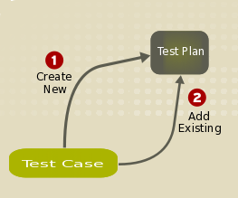
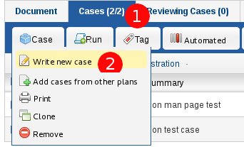
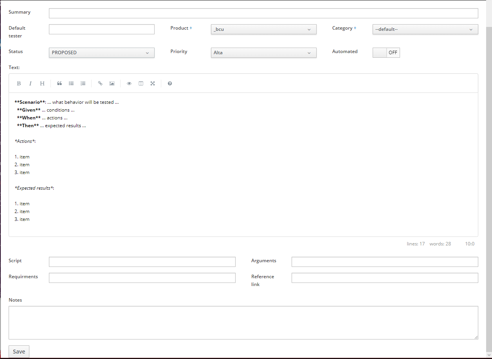
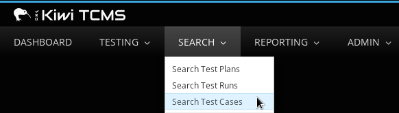
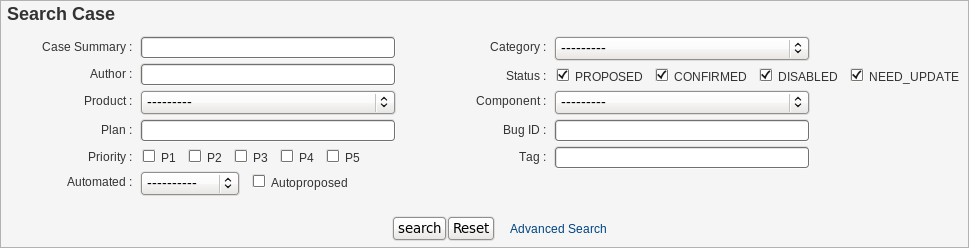
.. |Test Case search results| image:: ../_static/Search_Results.png
.. |The Edit button| image:: ../_static/Click_Edit.png
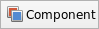
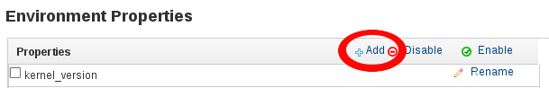
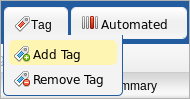
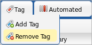
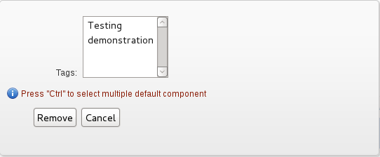
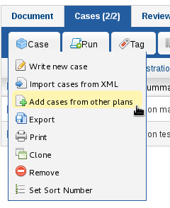
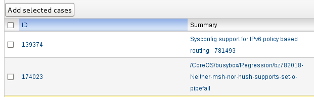
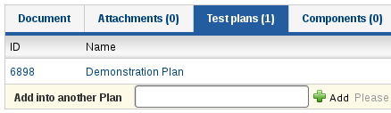
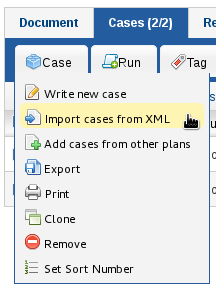
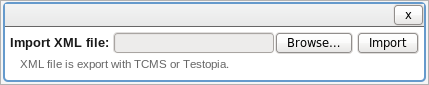
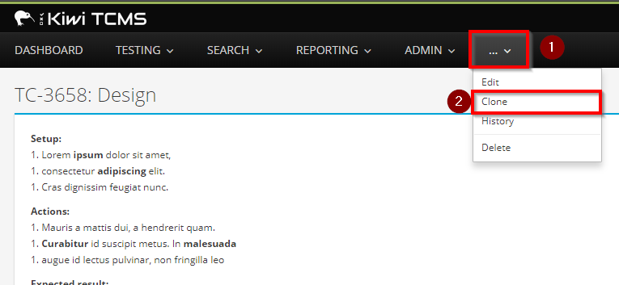
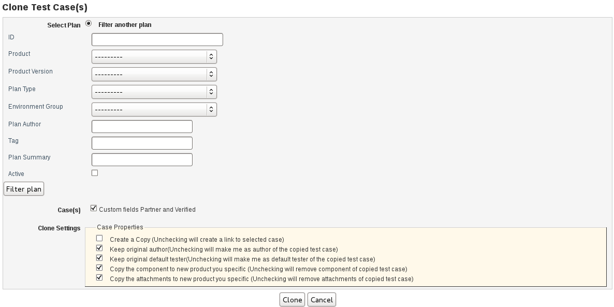
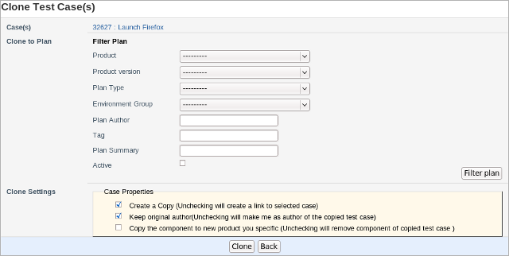
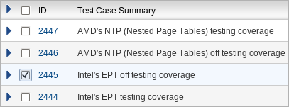
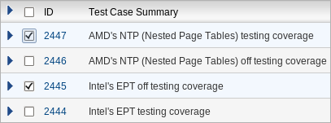
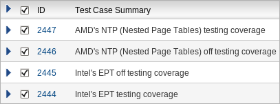
.. |Test Case status options.| image:: ../_static/Select_Status.png
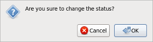
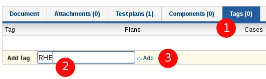
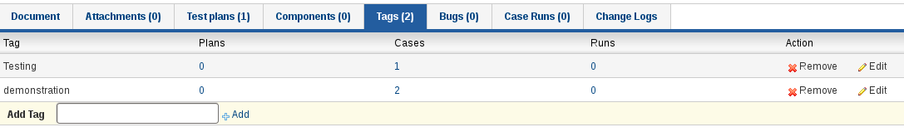
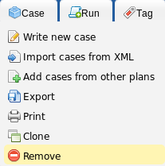
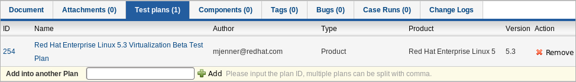
.. |The advanced search window.| image:: ../_static/Advanced_Search.png
