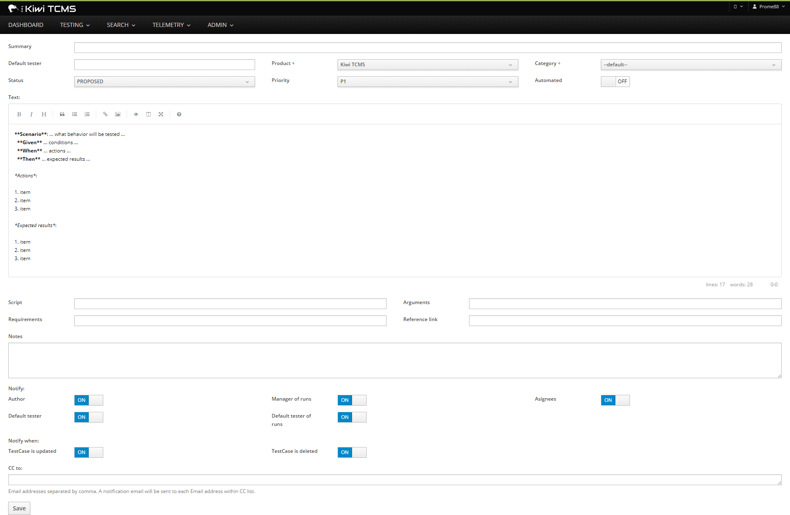
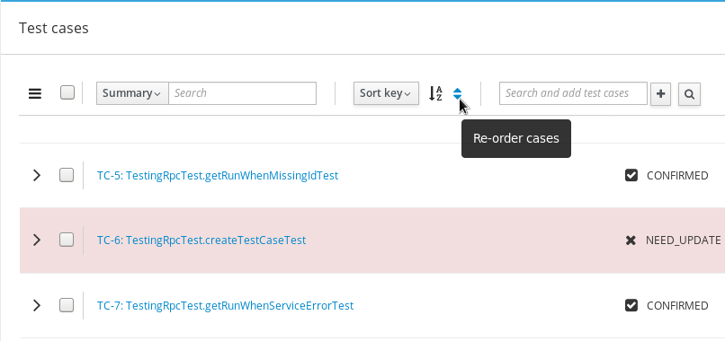

.. _testcase:

Test Cases
==========

This chapter explains how to create, search, edit, clone,
review, tag and remove Test Cases in Kiwi TCMS. Test Cases can not be
deleted, instead they have their **Active** status set to False.

There are three ways to associate Test Cases with a Test Plan:

#. Create a new Test Case, see :ref:`create-test-case`.
#. Add an existing Test Case, :ref:`use-existing-test-case`.

|Test Plan workflow|

Searching for Test Cases
------------------------

To search Test Cases:

#. From the **Main menu** click **SEARCH::Search Test Cases**.

   |The Testing menu 1|

#. In the **Search Case** screen, enter the required search details.

   |The Search Case screen|

#. Click **Search** button. The search results appear.

   |Test Case search results|

.. _create-test-case:

Creating a Test Case
--------------------

When writing a Test Case clear setup instructions help reduce the chance of
failure due to an incorrect environment. A clear set of actions with
measurable expected results ensures that the Test Case produces
consistent outcomes regardless of who executes it. Breakdown instructions
should be provided to ensure the test environment is returned to its original
state. For more information see :ref:`appendix`.

To create a new Test Case inside a Test Plan document:

#. Open an existing Test Plan, click **Cases** tab.
#. Hover over **Cases** sub-menu, then click on **Write new case**.

   |The Write New Case button|

#. In the add new case screen, perform the following actions:

   -  Enter a **Summary**. This will appear in search results. It must
      be informative and concise.
   -  Select the **Product**. The product of the component being tested.
   -  Select the **Component**. The part of a product being tested.
      Multiple components for one Test Case are supported.
   -  Select the **Category**. This is the type of test being executed. For
      example, Regression or Bug Verification.
   -  Select the **Automated** status: manual, auto, or autoproposed.
   -  Enter the **Requirement** (optional, legacy Testopia field).
   -  Enter **Script** (optional, legacy Testopia field).
   -  Enter **Alias** (optional).
   -  Enter the **Default Tester** (optional). Must be a valid email address registered in Kiwi TCMS.
      This user will be notified by email when a Test Run is created.
   -  Select the **Estimated Time** (optional) to execute the Test Case. This is
      used as a guide when allocating resources.
   -  Select the **Priority**. This is a sliding scale, with P1 being
      the highest. Priority can be used as a guide when allocating
      resources.
   -  Enter **Arguments** (optional). These are arguments to **Script**
      however further integration is not implemented at the moment!
   -  Enter **Reference Link** (optional). This is a user-specified field and can
      be a URL to git, Bugzilla or another reference.
   -  Enter **Tags** relevant to the test case.
   -  Enter **Notes**. Additional information about the Test Case.
   -  In the **Setup** text box, enter the setup instructions. Precise,
      clear setup instructions help produce repeatable test results.
   -  In the **Actions** text box, enter the steps to be performed.
      Write clear atomic actions (for example, browse to
      `www.github.com <http://www.github.com>`__), rather than vague
      statements (for example, browse the web).
   -  In the **Expected Results** text box, enter the measurable
      results. There should be a 1:1 correlation with the actions.
   -  In the **Breakdown** text box, enter the post test breakdown
      instructions. It is important that test environment is returned to the
      original state following a Test Run.

   |The add new case screen|

#. Perform one of the following:

   -  To save and exit, click **Save**.
   -  To save and create another Test Case, click **Save and add
      another**.
   -  To cancel the process and return to the Test Plan screen, click
      **Back**.

.. note:

    Kiwi TCMS allows you to enter free form text for any of the Test Case
    description fields. We advise that you use
    `Given-When-Then <https://github.com/cucumber/cucumber/wiki/Given-When-Then>`_
    combined with a list of steps to reproduce!

Cloning Test Cases
------------------

Test Cases can be cloned to multiple Test Plans. Alternatively you can use the
Clone-Edit workflow to create similar Test Cases, within the same Test Plan,
very quickly! To clone a Test Case:

#. Open the Test Case to be cloned.
#. Click **Clone** button.

   |The Clone button 1|

#. Select the Test Plan for the cloned Test Case. Use the filter to
   narrow search results:

   |Test Plan filter details screen|

#. Tick the Test Plans you want to clone this Test Case into.
#. Update **Case Properties**:
#. Click **Clone** button.

   |Clone Test Case details screen|

#. The new cloned Test Case is displayed.

.. note::

  When **Create a copy** is selected Kiwi TCMS will create an exact copy of the Test Case,
  and link it to the new Test Plan. Changes to the cloned Test Case will
  not affect the original version.

.. _editing-testcase:

Editing a Test Case
-------------------

The Edit function modifies fields in a Test Case.

Editing a Test Case
~~~~~~~~~~~~~~~~~~~

To edit a Test Case:

#. Open a Test Plan and click **Edit** action for a selected Test Case.
   Alternatively open the Test Case by clicking on its ID and then click
   the **Edit** button.

   |The Edit button|

#. Edit the fields as required:
#. Perform one of the following:

   -  To save and exit, click **Save**.
   -  To save and create another Test Case, click **Save and add another**.
   -  To cancel the process and return to the Test Plan screen, click **Back**.

.. note::

   To view the change history, click **Edit History** in the top-right corner
   of the Test Case Edit view.

Bulk edit of components
~~~~~~~~~~~~~~~~~~~~~~~

Kiwi TCMS supports the bulk edit of components of a Test Case through the
Test Plan interface.

#. Open the Test Plan containing the Test Cases to be edited.
#. Select Test Cases to be edited.
#. Click **Component** sub-menu button.

   |The Component button 1|

#. Select the components, click **Add**.

   |The Component button 2|

#. The Test Plan will update.

Bulk add/remove of tags
~~~~~~~~~~~~~~~~~~~~~~~

Kiwi TCMS supports the bulk add/remove of tags of Test Cases through the Test
Plan interface.

#. Open to the Test Plan containing the Test Cases to be edited.
#. Select the Test cases to be edited.
#. To add a new tag:

   -  From the **Tag** sub-menu click **Add**.

      |The Test cases tags options Add|

   -  A pop-up will appear, type the tag name and press **Submit**.
   -  Click **Submit** button.

#. To remove an existing tag:

   -  From the **Tag** sub-menu click **Remove**.

      |The Test cases tags options Remove|

   -  Enter tag name. Kiwi TCMS will display adialog with existing tag names.

      |Tags remove list|

   -  Select which tags to remove and click **Submit** button.

Adding a tag via Test Case view
~~~~~~~~~~~~~~~~~~~~~~~~~~~~~~~

#. Open the Test Case to be edited, click the **Tags** tab.
#. Enter tag name.
#. Click **Add** button.

   |The Test Case tags tab 1|

Removing a tag via Test Case view
~~~~~~~~~~~~~~~~~~~~~~~~~~~~~~~~~

#. Open the Test Case to be edited, click the **Tags** tab.

   |The Test Case tags tab 2|

#. Click **Remove** action next to the tag to be deleted.

Reviewing a Test Case
---------------------

When a new Test Case is created inside a Test Plan its status is set to
PROPOSED. It is not possible to add such Test Cases to a Test Run for execution.
The review functionality allows other associates to provide feedback and
finally modify the status of a Test Case to CONFIRMED.

.. note::

    A Test Case should be executed by a tester in under 20 minutes. Refer to
    the below checklist when reviewing a Test Case. Does the Test Case have:

    -  All the environment setup information
    -  All the test data needed for the test
    -  A clear and concise summary
    -  A prerequisite section
    -  Clear actions with less than 15 steps
    -  Clear effects

To review a Test Case open the Test Plan view and:

#. Click **Reviewing Cases** tab.
#. Expand Test Case details.
#. Read the description and provide comments.
#. Once satisfied change the status to **CONFIRMED** via the **Status** drop-down.
#. Change history is available under the comments section.

|Test Case Review Screen|

.. note::

    Each user is able to delete only their own comments however we discourage you
    of deleting anything because you may lose vital history.

Test Case status can also be updated via the Test Plan view:

#. Open a Test Plan.
#. Select the Test Cases to be edited:

   -  Single Test Case - click the check-box beside the case ID.

      |A single Test Case selected|

   -  Multiple Test Cases - click the check-box beside each case ID.

      |Multiple Test Cases selected|

   -  All Test Cases - click the check-box in the column headings.

      |All Test Cases selected|

#. From **Status** sub-menu click **Status**.

   |Test Case status options.|

#. Click **Ok** to apply the changes.
#. Test Case status is updated.

   |Status changes confirmation.|

Changing the order of Test Cases in a Test Plan or Test Run
-----------------------------------------------------------

Kiwi TCMS allows the user to change the order of Test Cases within
a Test Plan or a Test Run. To change the order of Test Cases:

#. Open the Test Plan or Test Run.
#. From the right side of the UI, click **Re-order cases**.

    |Test Cases Reorder|

#. Drag Test Cases up or down to change their order.
#. Click **Done Sorting** button to complete the process. 

    |Test Cases Reorder Done|

.. note:: The **Done Sorting** button will change its name briefly to
   **Submitting Changes** before returning to **Re-order cases**.

.. _use-existing-test-case:

Adding an existing Test Case to Test Plan
-----------------------------------------

Existing Test Cases can be added to Test Plans in two different ways:

#. from the Test Case view or
#. from the Test Plan view.

Adding a Test Case via the Test Plan view
~~~~~~~~~~~~~~~~~~~~~~~~~~~~~~~~~~~~~~~~~~

#. Open an existing Test Plan, click **Cases** tab.
#. Click **Case** sub-menu, then click **Add cases from other plans**.

   |The Add cases from other plans button|

#. In the **Search Case** screen, enter the search criteria, and then
   click **Search**.
#. From the search results list, select the check box of the Test Cases
   to be added to the Test Plan.
#. Click **Add Selected Cases** button.

   |Add Selected Cases|

Adding a Test Plan via the Test Case view
~~~~~~~~~~~~~~~~~~~~~~~~~~~~~~~~~~~~~~~~~

#. Open an existing Test Case and click **Test Plans** tab.
#. In the **Add into another Plan** text box, enter the plan ID.
#. Click **Add** button.

   |The Test Plans tab|

#. A confirmation dialog will open.
#. Verify that chosen Test Plan details are correct.
#. Click **Submit** button.

Removing a Test Case from a Test Plan
-------------------------------------

Sometimes Test Cases need to be removed from Test Plans. For example after
cloning another Test Plan. There are two ways to remove a Test Case from a Test Plan:

#. Remove Test Case via the Test Plan view.
#. Remove Test Plan via the Test Case view.

Removing a Test Case via the Test Plan view
~~~~~~~~~~~~~~~~~~~~~~~~~~~~~~~~~~~~~~~~~~~

#. Open a Test Plan. Make sure **Cases** tab is active.
#. Select the Test Case check-box. You can select several Test Cases.
#. From the **Case** sub-menu click **Remove**.

   |The Remove button 1|

Removing a Test Plan via the Test Case view
~~~~~~~~~~~~~~~~~~~~~~~~~~~~~~~~~~~~~~~~~~~

#. Open the Test Case view.
#. Click **Test plans** tab.
#. Click **Remove** action button.

   |The Remove button 2|

.. |Test Plan workflow| image:: ../_static/workflow.png
.. |The Write New Case button| image:: ../_static/Create_New_Case.png

.. |The Testing menu 1| image:: ../_static/Click_Cases.png
.. |The Search Case screen| image:: ../_static/Cases_Home.png

.. |The Edit button| image:: ../_static/Test_Case_Edit_From_Plan.png
.. |The Component button 1| image:: ../_static/Click_Component.png
.. |The Component button 2| image:: ../_static/Bulk_Add_Test_Case_Components.png
.. |The Test cases tags options Add| image:: ../_static/Tags_Add.png
.. |The Test cases tags options Remove| image:: ../_static/Tags_Remove.png
.. |Tags remove list| image:: ../_static/Tags_Autocomplete.png
.. |The Add cases from other plans button| image:: ../_static/TC_Add_To_Plan_TP.png
.. |Add Selected Cases| image:: ../_static/Click_Add_To_Plan_Name.png
.. |The Test Plans tab| image:: ../_static/TC_Add_To_Plan.png
.. |The Clone button 1| image:: ../_static/Click_Clone.png
.. |Test Plan filter details screen| image:: ../_static/Click_Filter_Plan.png
.. |Clone Test Case details screen| image:: ../_static/Enter_Clone_Details.png
.. |A single Test Case selected| image:: ../_static/Select_Single.png
.. |Multiple Test Cases selected| image:: ../_static/Select_Multiple.png
.. |All Test Cases selected| image:: ../_static/Select_All.png
.. |Test Case status options.| image:: ../_static/Select_Status.png
.. |Status changes confirmation.| image:: ../_static/Change_Status_Confirm.png
.. |The Test Case tags tab 1| image:: ../_static/TC_Tag.png
.. |The Test Case tags tab 2| image:: ../_static/Tab_Tags.png
.. |The Remove button 1| image:: ../_static/Click_Remove_TC.png
.. |The Remove button 2| image:: ../_static/Click_Remove_TP.png
.. |Test Case Review Screen| image:: ../_static/Test_Case_Review.png

.. |Test Cases Reorder Done| image:: ../_static/Test_Cases_Reorder_Done.png
