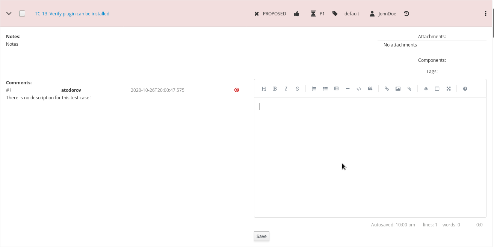
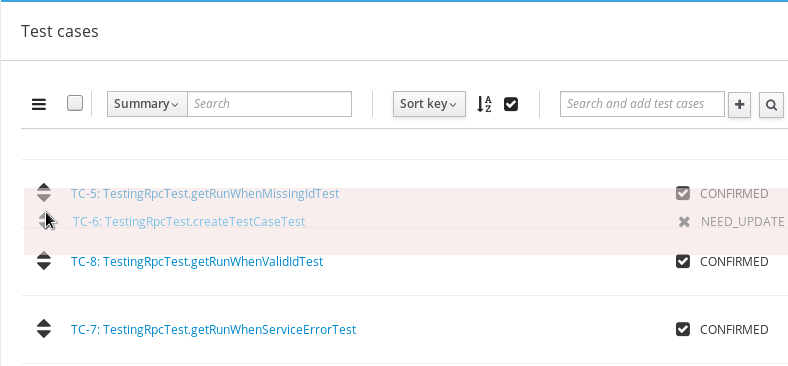

.. _testcase:

Test Cases
==========

When writing a test case clear setup instructions help reduce the chance of
failure due to an incorrect environment. A clear set of actions with
measurable expected results ensures that the test case produces
consistent outcomes regardless of who executes it. Breakdown instructions
should be provided to ensure the test environment is returned to its original
state. For more information see :ref:`appendix`.

There are several ways to associate test cases and test plans:

#. :ref:`add-plan-to-case`
#. :ref:`create-test-case`
#. :ref:`use-existing-test-case`

|Test Plan workflow|

.. _add-plan-to-case:

Add an existing test plan to test case
--------------------------------------

To associate test plan with an existing test case:

#. Open an existing test case and locate the **Test plans** card
#. Type the plan ID or name in the auto-complete text field
#. Select the appropriate plan and press Enter or click the + button

   |Add TestPlan To Case|

.. _create-test-case:

Create test case from a test plan
---------------------------------

To create a new test case inside a test plan document:

#. Open an existing Test Plan, click the bulk-update dropdown menu
#. Click the **New Test Case** item

   |Test Plan bulk-update|

#. On the newly opened page fill-in all of the necessary details and
   click the **Save** button

   |The add new case screen|

.. _use-existing-test-case:

Add an existing test case to test plan
--------------------------------------

Existing test cases can be added to test plans by utilizing the toolbar:

#. Open an existing test plan
#. Quick search by case ID or summary with auto-complete

   |Add TestCase To Plan|

#. and press Enter or click the + button or
#. Click the looking glass button for an advanced search pop-up

Cloning Test Cases
------------------

You can use the Clone-Edit workflow to create similar Test Cases,
within the same Test Plan, very quickly! To clone a Test Case:

#. Open the Test Case to be cloned.
#. Click **Clone** from the Navigation menu

   |The Clone button 1|

#. Update the name and click **Save**

Reviewing a Test Case
---------------------

Test cases with any status can be added to a test plan however only
CONFIRMED cases can be added to a test run for execution. The peer-review
functionality allows others to provide feedback before finally modifying the
status of a Test Case to CONFIRMED.

.. note::

    A Test Case should be executed by a tester in under 20 minutes. Refer to
    the below checklist when reviewing a Test Case. Does the Test Case have:

    -  All the environment setup information
    -  All the test data needed for the test
    -  A clear and concise summary
    -  A prerequisite section
    -  Clear actions with less than 15 steps
    -  Clear effects

|Test Case Review Screen|

Changing the order of Test Cases in a Test Plan
-----------------------------------------------

Kiwi TCMS allows the user to change the order of Test Cases within
a Test Plan. To change the order of Test Cases:

#. Open the Test Plan.
#. From the toolbar click **Re-order cases** button.

   |Test Cases Reorder|

#. Drag test cases up or down by using the double arrows button on the left
#. Click the checkbox toolbar button to complete the process

   |Test Cases Reorder Done|

.. |Test Plan workflow| image:: ../_static/workflow.png
.. |The add new case screen| image:: ../_static/Case_Enter_Details.png

.. |Test Cases Reorder| image:: ../_static/Test_Cases_Reorder.png

.. |Test Plan bulk-update| image:: ../_static/Test_Plan_Bulk_Update.png

