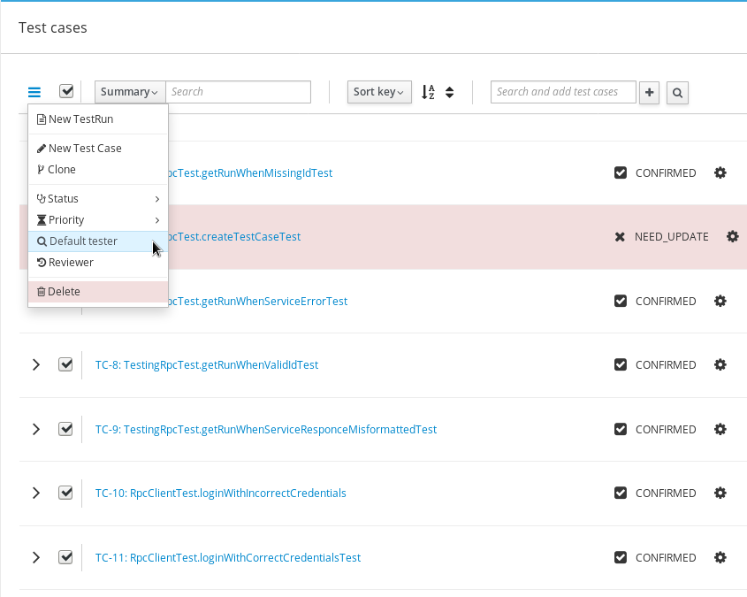
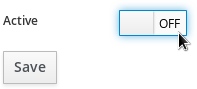

.. _testplan:

Test Plans
==========

This chapter explains how to create, search, clone, edit, tag, print,
disable, and export a Test Plan in Kiwi TCMS.

.. _searching-testplans:

Searching for Test Plans
------------------------

To view the Test Plans you have created, click **Personal menu::My Test Plans**.

|My Test Plans menu|

Other Test Plans can be searched via the **SEARCH** item in the **Main menu**:

#. Click **SEARCH::Search Test Plans**

   |The Search menu|

#. In the **Search Plan** screen, enter the required search details.

   |The Search Plan screen|

#. Click the **Search** button and the search results appear.
#. To sort on a column, click the column heading.

   |Click column to sort by.|

.. note::

  There is no need to use wildcard characters. The search results show all
  occurrences of the string, regardless of location. For example,
  searching for the **Plan Name** 'x11' will return plans named 'xorg-x11'
  and 'libX11'.

.. _creating-testplan:

Creating a Test Plan
--------------------

A Test Plan should identify which features of a product will be tested
and what the overall test strategy is. This is a high level document which
should not include specific testing steps. It is recommended to use an
`IEEE 829 Test Plan <http://www.fit.vutbr.cz/study/courses/ITS/public/ieee829.html>`_
format but you are free to enter any kind of text. To create a Test Plan:

#. From the **Main menu**, click **TESTING::New Test Plan**.

   |The Planning menu 1|

#. In the **Create New Test Plan** screen, perform the following
   actions:

   -  Enter the **Name**
   -  Select the **Product**
   -  Select the **Version**
   -  Select the **Type** of Test Plan
   -  Enter the **Parent ID**, this is optional
   -  In the **Plan Document** text box enter the details of the Test Plan
   -  Enter a **Reference Link** to any additional information (eg. a wiki
      page), this is optional

   |The Create New Test Plans screen|

#. Click the **Save** button

.. _cloning-testplan:

Cloning a Test Plan
-------------------

Cloning allows a user to replicate an existing Test Plan for a new
product or a new version of the current product. To clone a Test Plan:

#. Open the Test Plan which will be cloned.
#. From the object navigation menu click the **Clone** item.

   |Test plan action buttons|

#. In the **Clone TestPlan** screen, perform the following actions:

   -  Enter the **Name**.
   -  In **Product**, select the product.
   -  In **Version**, select the version.
   -  Tick the **Clone TCs** if you want to clone test cases, otherwise
      they will be only linked into new TP
   -  Tick the **Parent TP** if you want create parent-child relation
      to new TP

   |The Clone Test Plan screen|

#. Click the **Clone** button and the new Test Plan will be created.

Editing a Test Plan
-------------------

The Edit function modifies fields in a Test Plan. It does not change any
Test Cases or Test Runs associated with the Test Plan. To edit a Test Plan:

#. Open the Test Plan to be edited.
#. From the object navigation menu click the **Edit** item.

   |Test plan action buttons|

#. Edit the fields as required:

   |Edit a Test Plan|

#. Click the **Save** button.

Change History
~~~~~~~~~~~~~~

To view changes of a Test Plan document:

#. Open the Test Plan
#. From the object navigation menu click the **History** item

   |Test plan action buttons|

Bulk update
~~~~~~~~~~~

To perform bulk-update for selected test cases:

#. Select the test cases to be updated
#. Click the bulk-update menu dropdown

   |Test Plan bulk-update|

#. Select which attribute to update
#. Enter the new value
#. Click **OK**.

Disabling a Test Plan
~~~~~~~~~~~~~~~~~~~~~

A disabled Test Plan can not be used to create Test Runs. However,
unlike deletion, it does not permanently remove the Test Plan from the
database. It is best to disable older Test Plans instead of deleting them
otherwise you will lose your testing history. To disable a Test Plan:

#. Open the Test Plan to be disabled.
#. From the object navigation menu click the **Edit** item.
#. At the bottom of the screen toggle the **Active** button to **Off**

   |Test Plan Active Button|

#. Click on **Save** button to confirm changes.

The plan headline changes to a strike-through font.

|Test Plan Disabled|

Re-enable a Test Plan
~~~~~~~~~~~~~~~~~~~~~

To enable a disabled plan:

#. From the object navigation menu click the **Edit** item
#. Toggle **Active** button to **On**
#. Click on **Save** button to confirm changes.

Exporting Test Cases from a Test Plan
-------------------------------------

See :ref:`import-export`.

.. |The Planning menu 1| image:: ../_static/Click_New_Plan.png
.. |My Test Plans menu| image:: ../_static/My_Test_Plans.png
.. |The Create New Test Plans screen| image:: ../_static/Plan_Details.png
.. |The Search menu| image:: ../_static/Click_Search.png
.. |The Search Plan screen| image:: ../_static/Planning_Home.png
.. |Click column to sort by.| image:: ../_static/Sort_By_Column.png
.. |The Clone Test Plan screen| image:: ../_static/Clone_Details.png
.. |Edit a Test Plan| image:: ../_static/Edit_Test_Plan.png

.. |Test Plan Disabled| image:: ../_static/Test_Plan_Disabled.png
.. |Test plan action buttons| image:: ../_static/Test_Plan_Actions.png

