.. _testplan:

Test Plans
==========

This chapter explains how to create, search, clone, edit, tag, print,
disable, and export a Test Plan in the TCMS.

Creating a Test Plan
--------------------

This section outlines the process for creating a Test Plan in TCMS. A
Test Plan should identify which features of a product will be tested. It
is a high level document and should not include specific testing steps.

Procedure: Creating a Test Plan
~~~~~~~~~~~~~~~~~~~~~~~~~~~~~~~

To create a Test Plan:

#. From the **PLANNING** menu, click **New Plan**.

   |The Planning menu 1|

#. In the **Create New Test Plan** screen, perform the following
   actions:

   -  Enter the **Plan Name**.
   -  Select the **Product**.
   -  Select the **Product Version**.
   -  Select the **Type** of Test Plan.
   -  Enter the **Parent ID**. Optional parent Test Plan ID for tree
      view.
   -  In the **Plan Document** text box do one of the following:

      -  Enter the details of the Test Plan.
      -  Click **Browse**, select the file to upload, and then click
         **Upload**. Supported formats: html, plain text, and ODT.

   -  Select the **Environment Group**.
   -  Enter a **Reference Link** to any additional information (eg.
      wiki).

   |The Create New Test Plans screen|

#. Click **Create Test Plan**. The Test Plan is created.

Searching for Test Plans
------------------------

To view the Test Plans you have created, click **PLANNING**, then **My
Plans**. Test Plans by other authors can be searched using the following
fields:

-  Plan Name
-  Author
-  Case default tester
-  Plan Type
-  Status (Active/All)
-  Product
-  Product Version
-  Environment Group
-  Tag
-  Date Created (before/after)

.. note::

  There is no need to use wildcard characters. The search results show all
  occurrences of the string, regardless of location. For example,
  searching for the **Plan Name** 'x11' will return plans named 'xorg-x11'
  and 'libX11'.

Procedure: Searching for Test Plans
~~~~~~~~~~~~~~~~~~~~~~~~~~~~~~~~~~~

To search for Test Plans:

#. Click **PLANNING**.

   |The Planning menu 2|

#. In the **Search Plan** screen, enter the required search details.

   |The Search Plan screen|

#. Click **Search**. The search results appear.

   |Test Plan search results|

#. To sort on a column, click the column heading.

   |Click column to sort by.|

Advanced search
~~~~~~~~~~~~~~~

Advanced search accepts a combination of fields from Test Plan, Case,
and Run.

Procedure: Advanced Search
^^^^^^^^^^^^^^^^^^^^^^^^^^

To use advanced search for Test Plans, Cases and Runs:

#. In the search screen, click **Advanced Search**
#. Enter the required search terms.

   |The advanced search window.|

#. Click **Search Plan**.

Cloning a Test Plan
-------------------

Cloning allows a user to replicate an existing Test Plan for a new
product or a new version of the current product.

Procedure: Cloning a Test Plan
~~~~~~~~~~~~~~~~~~~~~~~~~~~~~~

To clone a Test Plan:

#. Select the Test Plan to be cloned.
#. Click **Clone Plan**.

   |The Clone plan button|

#. In the **Clone Test Plan** screen, perform the following actions:

   -  Enter the **New Plan Name**.
   -  In **Copy to Product**, select the product.
   -  In **Product Version**, select the version.
   -  In **Copy Settings**, select:

      -  **Set source plan as parent**
      -  **Keep original author**
      -  **Copy Plan Document**
      -  **Copy Plan Attachments**
      -  **Copy environment group**
      -  **Copy All Test Cases** This selects the following options:

         -  **Create a copy.** Selecting this option creates a new copy
            of the Test Cases and links them to this Test Plan. Changes
            made to these Test Cases will not effect the original Test
            Plan.
         -  **Maintain original authors**
         -  **Keep Default Tester**

   |The Clone Test Plan screen|

#. Click **Clone**. The Test Plan is cloned.

Editing a Test Plan
-------------------

The Edit function modifies fields in a Test Plan. It does not change any
Test Cases or Runs associated with the Test Plan.

Procedure: Editing a Test Plan
~~~~~~~~~~~~~~~~~~~~~~~~~~~~~~

To edit a Test Plan:

#. Select the Test Plan to be edited.
#. lick **Edit plan**.

   |The Edit plan button|

#. Edit the following fields as required:

   -  Plan Name
   -  Status (Active)
   -  Owner (input username)
   -  Product
   -  Product Version
   -  Plan Type
   -  Parent ID
   -  Plan Document
   -  Environment Group
   -  Reference Link
   -  Notification Include:

      -  Plan's owner
      -  Plan's author
      -  Author of the case under a plan
      -  Default tester of the case under a plan

   -  Notification Trigger:

      -  when plan is updated
      -  when plan is deleted
      -  when cases of a plan are updated

#. Click **Save**.

Default Components
~~~~~~~~~~~~~~~~~~

TCMS allows the setting of default components for a Test Plan. The
default components will be added to each Test Case belonging to the
plan.

Procedure: Editing default components
^^^^^^^^^^^^^^^^^^^^^^^^^^^^^^^^^^^^^

#. Select the Test Plan to be edited.
#. Click **Default Components**

   |The Default Components tab.|

#. To Add:

   -  Click **Update components**.
   -  Select the components.
   -  Click **Update**

   |The update components selection screen.|

#. To Remove:

   -  Select the components to remove.
   -  Click **Remove**

Edit History
^^^^^^^^^^^^

To view the changelog of Document, click **View Edit History**.

Test Plan Tags
--------------

The tag function is used to replace the Testopia "Group". Test Plans may
be searched/filtered by tag. A Test Plan can have more than one tag.

Procedure: Adding a tag
~~~~~~~~~~~~~~~~~~~~~~~

To add a new tag:

#. Select the Test Plan to be edited.
#. Click **Tags**

   |The Tags tab.|

#. To add:

   #. Input tag name.
   #. Click **Add**.

#. To remove:

   #. Select the tag to remove.
   #. Click **Remove**.

Updating the default tester
---------------------------

The default tester for a Test Case can be edited in the Test Plan
window.

Procedure: Updating the default tester
~~~~~~~~~~~~~~~~~~~~~~~~~~~~~~~~~~~~~~

To update the default tester:

#. Click **Cases**.
#. Select the Test Cases to be updated.
#. Click **Default tester**.

   |The default tester screen|

#. Enter the new tester's email.
#. Click **Ok**.

Using Tree View
---------------

The **Tree View** tab shows the current plan, its parents and children
using a tree style layout. It provides the ability to edit both parent
and child plans.

Procedure: Viewing a tree
~~~~~~~~~~~~~~~~~~~~~~~~~

#. Select the Test Plan.
#. Click **Tree View**.

   |The Tree View screen.|

   The tree is displayed.

Procedure: Changing the parent node
~~~~~~~~~~~~~~~~~~~~~~~~~~~~~~~~~~~

To change the parent node.

#. Click **Tree View**.
#. Click **Change parent node**.

   |Change parent.|

#. Enter the parent node ID.
#. Click **Ok**. The tree updates.

Procedure: Adding child nodes
~~~~~~~~~~~~~~~~~~~~~~~~~~~~~

To add child nodes.

#. Click **Tree View**.
#. Click **Add child node**.

   |Add child node.|

#. Enter the child node IDs. Separate multiple IDs with a comma.
#. Click **Ok**.
#. Verify the changes. Click **Submit**. The tree updates.

Procedure: Removing child nodes
~~~~~~~~~~~~~~~~~~~~~~~~~~~~~~~

To remove child nodes.

#. Click **Tree View**.
#. Click **Remove child node**.

   |Remove child node.|

#. Enter the child node IDs. Separate multiple IDs with a comma.
#. Click **Ok**.
#. Verify the changes. Click **Submit**. The tree updates.

Procedure: Navigating up to parent
~~~~~~~~~~~~~~~~~~~~~~~~~~~~~~~~~~

To navigate to the parent plan

#. Click **Up**.

   |Up button.|

#. Note that the plan is now shown in the full tree list.
#. Clicking on the arrowheads will expand or shrink the list of children
   that belong to a plan.

Printing a Test Plan
--------------------

Procedure: Printing a Test Plan
~~~~~~~~~~~~~~~~~~~~~~~~~~~~~~~

To print a Test Plan:

#. Select the Test Plan to be printed.
#. Click **Print Plan**.

   |The Print Plan button|

   A print version displays.
#. From the **File** menu in your Browser, click **Print**.

Disabling a Test Plan
---------------------

This section outlines the process for disabling a Test Plan in the TCMS.
A disabled Test Plan can not be used to create Test Runs. However,
unlike deletion, it does not permanently remove the Test Plan from the
TCMS.

Procedure: Disabling a Test Plan
~~~~~~~~~~~~~~~~~~~~~~~~~~~~~~~~

To disable a Test Plan:

#. Select the Test Plan to be disabled.
#. Click **Disable Plan**.

   |The disable plan button.|

   The plan name changes to a strike through font.
#. To enable a disabled plan, click **Enable plan**.

   |The enable plan button.|

Exporting a Test Plan
---------------------

TCMS implements the export feature in Testopia. This generates an XML
file listing all the Test Cases relating to the Test Plan. These files
can be imported into a Test Plan or used as a form of backup. The TCMS
will allow you to export all or selected Test Cases.

Procedure: Exporting a Test Plan
~~~~~~~~~~~~~~~~~~~~~~~~~~~~~~~~

To export a Test Plan:

#. Select the Test Plan to be exported.
#. Export the Test Cases

   -  All: click **Export all cases**.

      |The Export all cases button|

   -  Selected: click the Test Cases to export, click **Export Case**.

      |The Export Case button|

      The Browser's opening file dialog box appears.

#. Select **Save File**.
#. Click **Ok**.

The exported file can then be viewed, edited, or used as a template to
create other files. Exported files can also be imported back into TCMS,
for more information about importing see the section Importing a Test
Case.

Example: Sample exported XML file
~~~~~~~~~~~~~~~~~~~~~~~~~~~~~~~~~

.. literalinclude:: ../_static/tcms_testcases.xml
   :language: xml

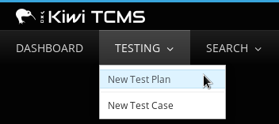
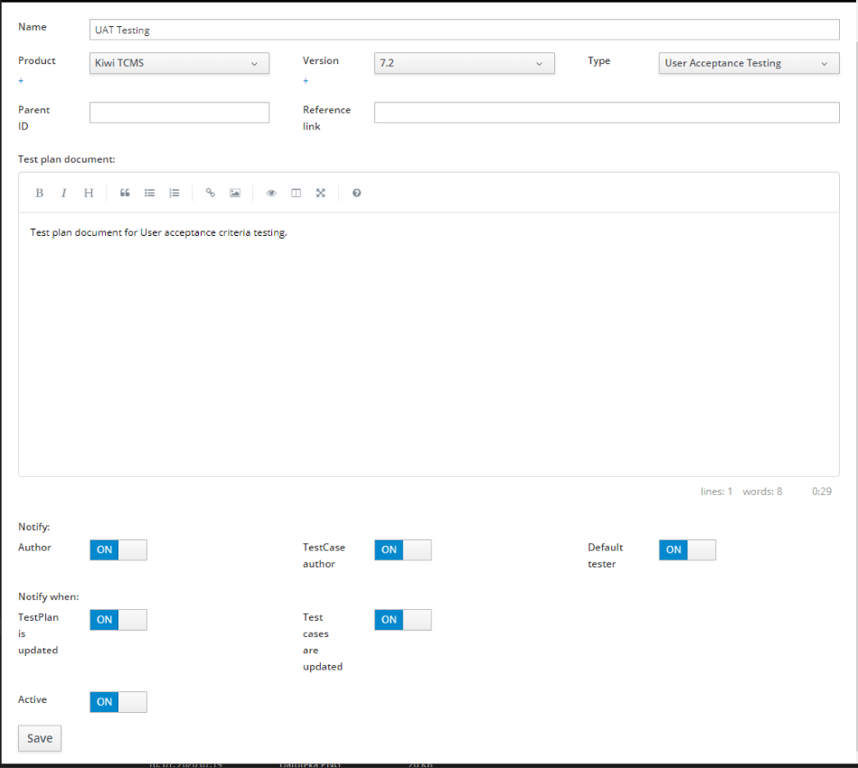

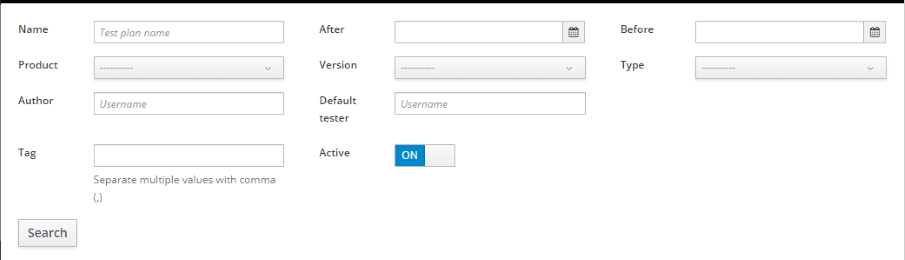
.. |Test Plan search results| image:: ../_static/Search_Results.png
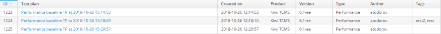
.. |The advanced search window.| image:: ../_static/Advanced_Search.png
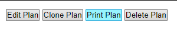
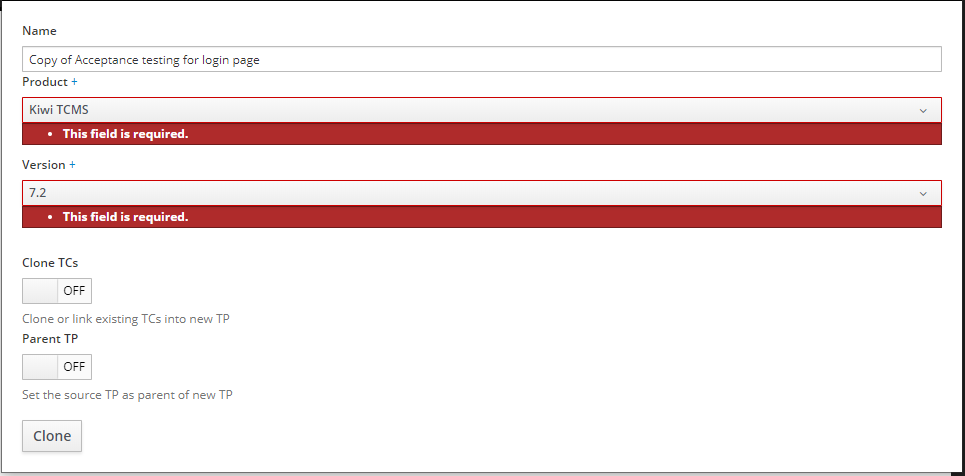

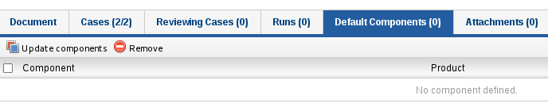
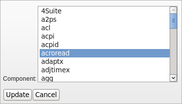
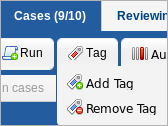
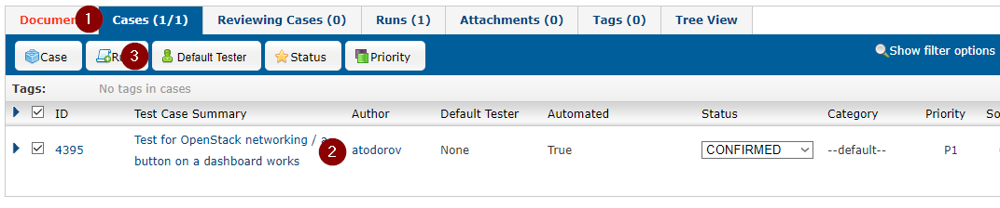
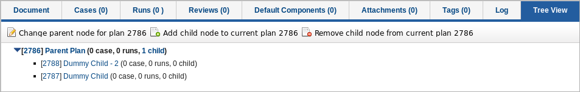

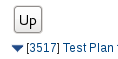

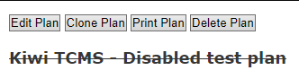

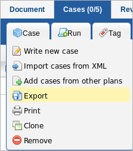
