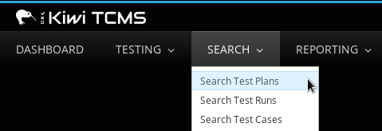
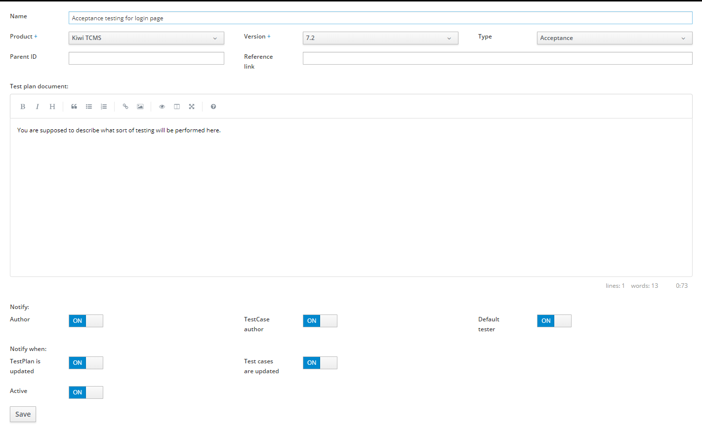

.. _testplan:

Test Plans
==========

This chapter explains how to create, search, clone, edit, tag, print,
disable, and export a Test Plan in Kiwi TCMS.

.. _searching-testplans:

Searching for Test Plans
------------------------

To view the Test Plans you have created, click **Personal menu::My Test Plans**.

   |My Test Plans menu|

Other Test Plans can be searched via the **SEARCH** item in the **Main menu**:

#. Click **SEARCH::Search Test Plans**

   |The Search menu|

#. In the **Search Plan** screen, enter the required search details.

   |The Search Plan screen|

#. Click the **Search** button and the search results appear.
#. To sort on a column, click the column heading.

   |Click column to sort by.|

.. note::

  There is no need to use wildcard characters. The search results show all
  occurrences of the string, regardless of location. For example,
  searching for the **Plan Name** 'x11' will return plans named 'xorg-x11'
  and 'libX11'.

.. _creating-testplan:

Creating a Test Plan
--------------------

A Test Plan should identify which features of a product will be tested
and what the overall test strategy is. This is a high level document which
should not include specific testing steps. It is recommended to use an
`IEEE 829 Test Plan <http://www.fit.vutbr.cz/study/courses/ITS/public/ieee829.html>`_
format but you are free to enter any kind of text. To create a Test Plan:

#. From the **Main menu**, click **TESTING::New Test Plan**.

   |The Planning menu 1|

#. In the **Create New Test Plan** screen, perform the following
   actions:

   -  Enter the **Name**
   -  Select the **Product**
   -  Select the **Version**
   -  Select the **Type** of Test Plan
   -  Enter the **Parent ID**, this is optional
   -  In the **Plan Document** text box enter the details of the Test Plan
   -  Enter a **Reference Link** to any additional information (eg. a wiki
      page), this is optional

   |The Create New Test Plans screen|

#. Click the **Save** button

.. _cloning-testplan:

Cloning a Test Plan
-------------------

Cloning allows a user to replicate an existing Test Plan for a new
product or a new version of the current product. To clone a Test Plan:

#. Open the Test Plan which will be cloned.
#. Click the **Clone Plan** button.

   |Test plan action buttons|

#. In the **Clone Test Plan** screen, perform the following actions:

   -  Enter the **Name**.
   -  In **Product**, select the product.
   -  In **Version**, select the version.
   -  Tick the **Clone TCs** if you want to clone test cases, otherwise
      they will be only linked into new TP
   -  Tick the **Parent TP** if you want create parent-child relation
      to new TP

   |The Clone Test Plan screen|

#. Click the **Clone** button and the new Test Plan will be created.

Editing a Test Plan
-------------------

The Edit function modifies fields in a Test Plan. It does not change any
Test Cases or Test Runs associated with the Test Plan. To edit a Test Plan:

#. Open the Test Plan to be edited.
#. Click the **Edit plan** button.

   |Test plan action buttons|

#. Edit the fields as required:

   |Edit a Test Plan|

#. Click the **Save** button.

Edit History
~~~~~~~~~~~~

To view the changelog of a Test Plan document,
click the **View Edit History**.

    |View Test Plan Edit History|

Test Plan Tags
~~~~~~~~~~~~~~

The tag function is used to classify and organize Test Plans. Test Plans may
be searched/filtered by tag and they can have more than one tag.
To add a new tag:

#. Open the Test Plan to be edited.
#. Click the **Tags** tab

   |The Tags tab.|

#. Enter tag name next to the **Add Tag** label.
#. Click the **Add** button.
#. To remove a tag click the **Remove** action.

Updating the default tester
~~~~~~~~~~~~~~~~~~~~~~~~~~~

The default tester for a Test Case can be edited in the Test Plan window:

#. Click the **Cases** tab.
#. Select the Test Cases to be updated.
#. Click the **Default tester** button.

   |The default tester screen|

#. Enter the new tester's email.
#. Click **Ok**.

Using Tree View
~~~~~~~~~~~~~~~

The **Tree View** tab shows the current plan, its parents and children
using a tree style layout. It provides the ability to edit both parent
and child plans.

   |The Tree View screen.|

Procedure: Changing the parent node
~~~~~~~~~~~~~~~~~~~~~~~~~~~~~~~~~~~

To change the parent node.

#. Click **Tree View** tab.
#. Click **Change parent node**.

   |Change parent.|

#. Enter the parent node ID.
#. Click **Ok**. The tree updates.
#. Verify the changes and click **Submit**. The tree updates.

Procedure: Adding child nodes
~~~~~~~~~~~~~~~~~~~~~~~~~~~~~

To add child nodes.

#. Click **Tree View** tab.
#. Click **Add child node**.

   |Add child node.|

#. Enter the child node IDs. Separate multiple IDs with a comma.
#. Click **Ok**.
#. Verify the changes and click **Submit**. The tree updates.

Procedure: Removing child nodes
~~~~~~~~~~~~~~~~~~~~~~~~~~~~~~~

To remove child nodes.

#. Click **Tree View** tab.
#. Click **Remove child node**.

   |Remove child node.|

#. Enter the child node IDs. Separate multiple IDs with a comma.
#. Click **Ok**.
#. Verify the changes. and click **Submit**. The tree updates.

Disabling a Test Plan
~~~~~~~~~~~~~~~~~~~~~

This section outlines the process for disabling a Test Plan in Kiwi TCMS.
A disabled Test Plan can not be used to create Test Runs. However,
unlike deletion, it does not permanently remove the Test Plan from the
database. It is best to disable older Test Plans instead of deleting them
otherwise you will lose your testing history. To disable a Test Plan:

#. Open the Test Plan to be disabled.
#. Click **Edit Plan** button.
#. Toggle **Active** status button to **Off**
#. Click on **Save** button to confirm changes.

   |Test Plan Disabled|

   The plan name changes to a strike through font.

Re-enable a Test Plan
~~~~~~~~~~~~~~~~~~~~~

#. To enable a disabled plan, click **Edit Plan**.
#. Set **Active** status button to **On**
#. Click on **Save** button to confirm changes.

Printing a Test Plan
--------------------

To print a Test Plan:

#. Open the Test Plan to be printed.
#. Click **Print Plan** button.

   |Test plan action buttons|

#. A printer friendly version displays.
#. From the **File** menu in your Browser, click **Print**.

Exporting Test Cases from a Test Plan
-------------------------------------

Kiwi TCMS offers functionality to export test cases via `TCMS API <https://kiwitcms.readthedocs.io/en/latest/import-export/>`_

.. |My Test Plans menu| image:: ../_static/My_Test_Plans.png
.. |The Create New Test Plans screen| image:: ../_static/Plan_Details.png

.. |The Search Plan screen| image:: ../_static/Planning_Home.png
.. |Click column to sort by.| image:: ../_static/Sort_By_Column.png
.. |The Clone Test Plan screen| image:: ../_static/Clone_Details.png

.. |View Test Plan Edit History| image:: ../_static/Test_Plan_View_Edit_History.png
.. |The Tags tab.| image:: ../_static/Test_Plan_Tags.png
.. |The default tester screen| image:: ../_static/TP_Update_Default_Tester.png
.. |The Tree View screen.| image:: ../_static/Tree_View_Home.png
.. |Change parent.| image:: ../_static/Tree_View_Change_Parent.png
.. |Add child node.| image:: ../_static/Tree_View_Add_Child.png
.. |Remove child node.| image:: ../_static/Tree_View_Remove_Child.png
.. |Test Plan Disabled| image:: ../_static/Test_Plan_Disabled.png

