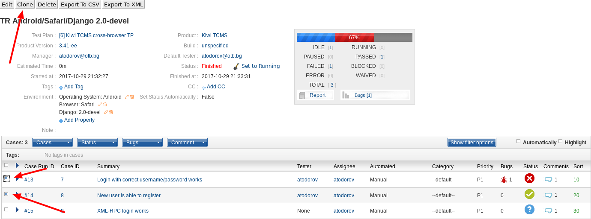
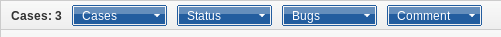

.. _testrun:

Test Runs
=========

This chapter explains how to create, search, edit, execute, and generate
reports for Test Runs in Kiwi TCMS. A Test Run in Kiwi TCMS contains the
execution results of selected test cases against particular product builds.

To view Test Runs you have created or are assigned to you click **Main menu::DASHBOARD**
or alternatively click **Personal menu::My Test Runs**.

Searching for Test Runs
-----------------------

To search for Test Runs:

#. From the **Main menu** click **SEARCH::Search Test Runs**.

   |The Testing menu 2|

.. _creating-testrun:

Creating a Test Run
-------------------

Test Runs are created for a specific Test Plan. Only Test Cases with a
status of **CONFIRMED** can be added to the Test Run. A Test Run can be
assigned to any user in Kiwi TCMS. To create a Test Run:

#. Open a Test Plan and click the **Cases** tab
#. From the **Run** sub-menu click on **Write new run**

   |The New Run button|

#. In the **Create New Test Run** screen, perform the following actions:

   -  Edit the **Summary**.
   -  Select the **Product**.
   -  Select the **Product Version**.
   -  Select the **Build**.
   -  Edit the **Run Manager**.
   -  Edit the **Default Tester**.
   -  Enter any **Notes**.

   |The Create New Test Run screen|

#. Test Cases will be shown under the above screen.
#. Click **Remove** action on any Test Cases that are not required for this
   Test Run.
#. Click **Save** button.

.. note::

    Kiwi TCMS notifies the default tester by email that they have been assigned a
    new Test Run!

Add Test Cases to an existing Test Run
--------------------------------------

To add a Test Case to an existing Test Run:

#. Open the Test Plan containing this Test Case.
#. Select Test Cases you want to add.
#. From **Run** sub-menu click **Add into Run** item.

   |The Add cases to run button|

#. Select the Test Run to which Test Cases will be added.
#. Click **Update** button.

   |The Update button|

.. note::

    Test Cases can be added via the Test Run view as well. While the Test Run
    is opened you may use the **Cases** sub-menu to add/remove other
    Test Cases to this Test Run.

Cloning a Test Run
------------------

Test Runs can be cloned for easier creation of testing tasks between
team members.
To clone a Test Run:

#. Open the Test Run.
#. Select which Test Case executions (aka test case-runs) to be cloned.
   Use a filter, if required, to help restrict the number of visible
   runs.
#. Click **Clone** button at the top of the page.

   |The Clone button 2|

#. Enter the details for the cloned Test Run. Details are auto-populated
   from the original.
#. Click **Save** button.

Editing a Test Run
------------------

The Edit function modifies fields in a Test Run.

#. Open the Test Run to be edited, and then click **Edit** button.
#. Edit the fields as required:

   -  Summary
   -  Product
   -  Product version
   -  Manager
   -  Default Tester
   -  Notes
   -  Finished

#. Click **Save** button.

Changing the status of a Test Run
---------------------------------

A Test Run's status can be changed from **Running** to **Finished** even
if all Test Cases have not been completed.

To change the status of a Test Run:

#. Open the Test Run.
#. Click **Set to Finished**.

   |The Set to finished button|

#. To re-activate a Test Run, click **Set to Running**.

   |The Set to running button|

.. note::

  It is also possible to change the status of a Test Run from the Edit
  Test Run menu.

Deleting a Test Run
-------------------

To delete a Test Run:

#. Open the Test Run to be deleted.
#. Click **Delete** button.
#. Click **Ok** to delete or **Cancel** to return.

   |The Delete confirmation screen.|

.. _executing-testrun:

Executing a Test Run
--------------------

Test Runs can be executed at any time. The user can execute any of the
Test Cases within a run, regardless of the order they appear. Use the
**Comment** field to make notes about a Test Case. All comments will be
displayed when a report is generated for a Test Run.

To execute a Test Run:

#. From the Dashboard or a Test Runs list, click the Test Run to execute. The
   Test Run summary is displayed.  You are able to change Test Case statuses
   from this page.

   |The Test Run summary|

#. After executing a Test Case expand its widget, enter a **Comment** and
   select the appropriate **Status** icon.

   |A Test Case|

Bulk update of Test Cases
~~~~~~~~~~~~~~~~~~~~~~~~~

Bulk operations include change case-runs status, add/remove bug by entering
bug ID, add comment to case-run.

#. Select the Test Cases to be updated.
#. Click on the sub-menu for the required operation:

    |Test Case-run bulk menu|

.. _generate-testrun-report:

Generating a Test Run report
----------------------------

Kiwi TCMS generates reports for Test Runs, regardless of their state. A
report provides the following information:

-  **Plan details:**

   -  Product
   -  Product version
   -  Plan
   -  Plan version
   -  Platform
   -  Operating system
   -  Run summary
   -  Run notes
   -  Start date
   -  Stop date.

-  **Test Case details:**

   -  Closed at
   -  ID
   -  Summary
   -  Case ID
   -  Tested by
   -  Group
   -  Status

-  **Summary statistics:**

   -  Total number of Test Cases Run.
   -  Total number of Pending Test Cases.
   -  Test Run completed (%).

-  **Bug List:**

   -  Individual bugs
   -  View all bugs (if bug tracker allows it)

To generate a report for a Test Run:

#. Open the Test Run.
#. From the **Case Status** widget, click **Report**.

   |The Report button|

#. A printer friendly version displays.

.. |The New Run button| image:: ../_static/Click_Write_New_Run.png
.. |The Create New Test Run screen| image:: ../_static/Create_New_Test_Run.png
.. |The Add cases to run button| image:: ../_static/Click_Add_Cases_to_Run.png
.. |The Update button| image:: ../_static/Select_Plan_Click_Update.png
.. |The Testing menu 2| image:: ../_static/Click_Runs.png
.. |The Delete confirmation screen.| image:: ../_static/Ok_Delete.png

.. |The Test Run summary| image:: ../_static/Runs_Details.png
.. |A Test Case| image:: ../_static/Enter_Test_Results.png
.. |The Set to finished button| image:: ../_static/Set_To_Finished.png
.. |The Set to running button| image:: ../_static/Set_To_Running.png
.. |The Report button| image:: ../_static/Click_Report.png

