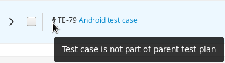

.. _testrun:

Test Runs
=========

This chapter explains how to create, search, edit, execute, and generate
reports for Test Runs in Kiwi TCMS. A Test Run in Kiwi TCMS contains the
execution results of selected test cases against particular product builds.

To view Test Runs you have created or are assigned to you click **Main menu::DASHBOARD**
or alternatively click **Personal menu::My Test Runs**.

Searching for Test Runs
-----------------------

To search for Test Runs:

#. From the **Main menu** click **SEARCH::Search Test Runs**.

   |The Testing menu 2|

.. _creating-testrun:

Creating a Test Run
-------------------

Test runs are created for a specific Test Plan. Only Test Cases which are
confirmed (aka ready for execution) can be added to the Test Run. A Test Run
can be assigned to any user in Kiwi TCMS. To create a Test Run:

#. Open a Test Plan
#. Select test cases for execution
#. From the bulk-update menu click **New TestRun**

   |The New Run button|

#. In the **New TestRun** page, perform the following actions:

   -  Edit the **Summary**.
   -  Select **Build**.
   -  Select **Manager**.
   -  Select **Default Tester**.
   -  Enter any **Notes**.

   |The Create New Test Run screen|

#. Confirmed Test Cases will be shown at the bottom of the above page.
#. Click **Save** button.

.. note::

    Kiwi TCMS notifies the default tester by email that they have been assigned a
    new Test Run!

Add Test Cases to an existing Test Run
--------------------------------------

To add a Test Case to an existing Test Run:

#. Open the Test Run.
#. Use the quick search widget to find and add test cases.

   |The Add cases to run button|

#. Confirmed test cases will be added to the test run.
#. Alternatively you can use the advanced search widget which allows more
   flexible search for test cases across the entire database.

.. note::

    As of version 8.9 Kiwi TCMS allows test runs to contain test cases
    which are not part of the parent test plan. They are indicated with
    a thunderbolt icon in front of their name.

        |Stand alone TC|

Cloning a Test Run
------------------

Test Runs can be cloned for easier creation of testing tasks between
team members. To clone a Test Run:

#. Open the Test Run.
#. From the object navigation menu click the Clone item.
#. Enter the details for the cloned Test Run. Details are auto-populated
   from the original.
#. Click **Save** button.

Editing a Test Run
------------------

The Edit function modifies fields in a Test Run.

#. Open the Test Run to be edited
#. From the object navigation menu click the Edit item.
#. Edit the fields as required:

   - Summary
   - Build
   - Manager
   - Default Tester
   - Notes

#. Click **Save** button.

Changing the status of a Test Run
---------------------------------

Since Kiwi TCMS v10.1 a Test Run status can be changed from

- **Undefined** to **Running** by clicking the button next to *Started at*
  field
- **Running** to **Finished** by clicking the button next to *Finished at*
  field

Once a Test Run is marked as finished its status can't be changed and timestamp
fields can't be modified further!

Deleting a Test Run
-------------------

To delete a Test Run:

#. Open the Test Run to be deleted.
#. From the object navigation menu click the Delete item.
#. Confirm the deletion.

.. _executing-testrun:

Executing a Test Run
--------------------

Test Runs can be executed at any time. Testers can execute any of the
Test Cases within a TR, regardless of the order they appear. Testers may also
add comments to annotate test executions:

#. Expand a test execution row, follow the steps to reproduce and when ready
   enter a **Comment** and select the appropriate **Status** button.

   |A Test Case|

.. |The New Run button| image:: ../_static/Click_Write_New_Run.png
.. |The Create New Test Run screen| image:: ../_static/Create_New_Test_Run.png
.. |The Add cases to run button| image:: ../_static/Click_Add_Cases_to_Run.png
.. |The Testing menu 2| image:: ../_static/Click_Runs.png
.. |A Test Case| image:: ../_static/Enter_Test_Results.png

