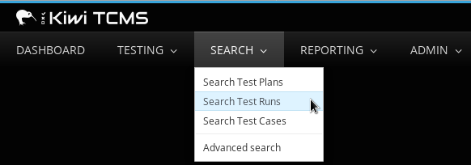

.. _testrun:

Test Runs
=========

This chapter explains how to create, search, edit, execute, and generate
reports for Test Runs in TCMS.

-  To view Test Runs you have created, click **TESTING**, then **My Runs**.
-  To view Test Runs assigned to you, click **View My Assigned Runs**.

Creating a Test Run
-------------------

Test Runs are created for a specific Test Plan. Only Test Cases with a
status of **CONFIRMED** will be added to the Test Run. A Test Run can be
assigned to any user in the TCMS.

Procedure: Creating a Test Run
~~~~~~~~~~~~~~~~~~~~~~~~~~~~~~

To create a Test Run:

#. Select a Test Plan, on the **Cases** tab hover over **Run** then
   click on **Write new run** from the drop-down menu.

   |The New Run button|

#. In the **Create New Test Run** screen, perform the following actions:

   -  Edit the **Summary**.
   -  Select the **Product**.
   -  Select the **Product Version**.
   -  Select the **Build**.
   -  Edit the **Run Manager**.
   -  Edit the **Default Tester**.
   -  If applicable, select the **Set Status Automatically** checkbox.
   -  Enter the **Estimated time**.
   -  Enter any **Notes**.
   -  Select **Environment** property values.

   |The Create New Test Run screen|

#. Click **Remove** on any Test Cases that are not required for this Test Run.

#. Click **Save**.

Procedure: Add Test Cases to an existing Test Run.
~~~~~~~~~~~~~~~~~~~~~~~~~~~~~~~~~~~~~~~~~~~~~~~~~~

To add a Test Case to a Test Run:

#. Select a Test Plan, use filter if required.
#. Click **Run** then **Add into Run** from the drop-down list.

   |The Add cases to run button|

#. Select the Test Run.
#. Click **Update**.

   |The Update button|

.. note::

   Test Cases can only be removed from a Test Run when it is created.

TCMS Notifications
~~~~~~~~~~~~~~~~~~

TCMS notifies the default tester by email that they have been assigned a
Test Run.

Example: Test Run Notification
^^^^^^^^^^^^^^^^^^^^^^^^^^^^^^
.. literalinclude:: ../_static/testrun_notification.xml
   :language: xml

Searching for Test Runs
-----------------------

To search Test Runs created by other authors, use the following fields:

-  Run Summary
-  Product
-  Environment group
-  Owner: Manager\|Tester, Manager, Default Tester
-  Case Run Assignee
-  Plan
-  Product version
-  Build
-  Status
-  Tag

Procedure: Searching for Test Runs
~~~~~~~~~~~~~~~~~~~~~~~~~~~~~~~~~~

To search for Test Runs:

#. From the **TESTING** menu, click **Search Runs**.

   |The Testing menu 2|

#. In the **Search Test Run** screen, enter the required search details.

   |The Search Test Run screen|

#. Click **Search**. The search results appear.

   |Test Run search results|

Advanced search
~~~~~~~~~~~~~~~

Advanced search accepts a combination of fields from Test Plan, Case,
and Run.

Procedure: Advanced Search
^^^^^^^^^^^^^^^^^^^^^^^^^^

To use advanced search for Test Plans, Cases and Runs:

#. In the search screen, click **Advanced Search**
#. Enter the required search terms.

   |The advanced search window.|

#. Click **Search Run**.

Editing a Test Run
------------------

The Edit function modifies fields in a Test Run.

Procedure: Editing a Test Run
~~~~~~~~~~~~~~~~~~~~~~~~~~~~~

To edit a Test Run:

#. Select the Test Run to be edited, and then click **Edit**.

   |The Edit button|

#. Edit the fields as required:

   -  Summary
   -  Product
   -  Product version
   -  Manager
   -  Default Tester
   -  Estimated Time
   -  Environment Property value
   -  Notes
   -  Finished

#. Click **Save**.

Deleting a Test Run
-------------------

A Test Run can be deleted (removed).

Procedure: Deleting a Test Run
~~~~~~~~~~~~~~~~~~~~~~~~~~~~~~

To delete a Test Run:

#. Browse to the Test Run.
#. Click **Delete**.

   |The Delete button|

#. Click **Ok** to delete or **Cancel** to return.

   |The Delete confirmation screen.|

Cloning a Test Run
------------------

A Test Run can be cloned.

Procedure: Cloning a Test Run
~~~~~~~~~~~~~~~~~~~~~~~~~~~~~

To clone a Test Run:

#. Browse to the Test Run.
#. Select test case-run(s) in the test run.
   Use a filter, if required, to help restrict the number of visible
   runs.
#. Click **Clone**.

   |The Clone button 2|

#. Enter the details for the cloned run.
   Details are auto-populated from the original run.
#. Click **Save**.

Executing a Test Run
--------------------

Test Runs can be executed at any time. The user can execute any of the
Test Cases within a run, regardless of the order they appear. Use the
**Comment** field to make notes about a Test Case. All comments will be
displayed when a report is generated for a Test Run. Upon completion of
a Test Run, the TCMS will annotate failed Test Cases with the message
"File Bug".

Procedure: Executing a Test Run
~~~~~~~~~~~~~~~~~~~~~~~~~~~~~~~

To execute a Test Run:

#. From the **TESTING** tab, click **My Runs**.
#. From the Test Runs list, click the Test Run to execute. The Test Run
   summary is displayed.

   |The Test Run summary|

   The user is able to change the Test Case status on this page. 
#. Execute each Test Case. Enter a **Comment** if required. Comments
   will be displayed when a report is generated for the Test Run.

   |A Test Case|

#. Select the appropriate **Status** icon.

   +-------------+---------------------------------------------------------------------------------------------------------------------------+
   | Icon        | Meaning                                                                                                                   |
   +=============+===========================================================================================================================+
   | |image78|   | Idle - Default value. The Test Case has not been examined.                                                                |
   +-------------+---------------------------------------------------------------------------------------------------------------------------+
   | |image79|   | Running - Test Case is in progress.                                                                                       |
   +-------------+---------------------------------------------------------------------------------------------------------------------------+
   | |image80|   | Paused - This status is used to denote a problem with the test case itself that prevents the test from being completed.   |
   +-------------+---------------------------------------------------------------------------------------------------------------------------+
   | |image81|   | Passed - Test Case met all the expected results.                                                                          |
   +-------------+---------------------------------------------------------------------------------------------------------------------------+
   | |image82|   | Failed - Test Case did not meet all the expected results, or produced an unhandled exception.                             |
   +-------------+---------------------------------------------------------------------------------------------------------------------------+
   | |image83|   | Blocked - Test Case has a dependency that has failed.                                                                     |
   +-------------+---------------------------------------------------------------------------------------------------------------------------+
   | |image84|   | Error - Test environment has problems that prevent Test Case     execution.                                               |
   +-------------+---------------------------------------------------------------------------------------------------------------------------+
   | |image85|   | Waived - Test Case is not suitable for this run or blocked by other cases.                                                |
   +-------------+---------------------------------------------------------------------------------------------------------------------------+

Procedure 4.9. Bulk update of Test Cases
~~~~~~~~~~~~~~~~~~~~~~~~~~~~~~~~~~~~~~~~

Bulk operations include change case-runs status, add/remove bug by input
bug ID from case-runs, add comment to case-run.

#. Select the Test Cases to be updated.
#. Click on the menu item for the required operation:

   -  Status - select the new status.
   -  Bugs - enter the Bug ID.
   -  Comment - input the comment.

.. note::

  It is important that you file bugs against Test Cases that fail. TCMS
  reminds users of this by annotating failed Test Cases with "File Bug".

Changing the status of a Test Run
---------------------------------

A Test Run's status can be changed from **Running** to **Finished** even
if all Test Cases have not been completed.

If the check box **Set Status Automatically** is selected in the test
run, when all the test cases in the run have a passed, failed or blocked
result; the test run's status will be changed to **Finished**.

Procedure: Changing Test Run status
~~~~~~~~~~~~~~~~~~~~~~~~~~~~~~~~~~~

To change the status of a Test Run:

#. Browse to the Test Run.
#. Click **Set to Finished**.

   |The Set to finished button|

#. To re-activate a Test Run, click **Set to Running**.

   |The Set to running button|

.. note:: **Change status in Edit Test Run**

  It is also possible to change the status of a Test Run from the Edit
  Test Run menu.

Generating a Test Run report
----------------------------

TCMS generates reports for Test Runs, regardless of their state. A
report provides the following information:

-  **Plan details:**

   -  Product 
   -  Product version
   -  Plan
   -  Plan version
   -  Platform
   -  Operating system
   -  Run summary
   -  Run notes
   -  Start date
   -  Stop date.

-  **Test Case details:**

   -  Closed at
   -  ID
   -  Summary
   -  Case ID
   -  Tested by
   -  Group
   -  Status

-  **Summary statistics:**

   -  Total number of Test Cases Run.
   -  Total number of Pending Test Cases.
   -  Test Run completed (%).

-  **Bug List:**

   -  Individual bugs
   -  View all bugs

Procedure: Generating a report for a Test Run.
~~~~~~~~~~~~~~~~~~~~~~~~~~~~~~~~~~~~~~~~~~~~~~

To generate a report for a Test Run:

#. Select the Test Run.
#. From the **Case Status** box, click **Report**.

   |The Report button|

   A printable version displays.
#. From the **File** menu in your Browser, click **Print**.

.. |The Create New Test Run screen| image:: ../_static/Create_New_Test_Run.png
.. |The Add cases to run button| image:: ../_static/Click_Add_Cases_to_Run.png
.. |The Update button| image:: ../_static/Select_Plan_Click_Update.png

.. |The Search Test Run screen| image:: ../_static/Runs_Home.png
.. |Test Run search results| image:: ../_static/Search_Results.png
.. |The Delete button| image:: ../_static/Click_Edit.png
.. |The Delete confirmation screen.| image:: ../_static/Ok_Delete.png
.. |The Clone button 2| image:: ../_static/Click_Edit.png
.. |The Test Run summary| image:: ../_static/Runs_Details.png

.. |image70| image:: ../_static/idle.png
.. |image71| image:: ../_static/running.png
.. |image72| image:: ../_static/paused.png
.. |image73| image:: ../_static/pass.png
.. |image74| image:: ../_static/failed.png
.. |image75| image:: ../_static/blocked.png
.. |image76| image:: ../_static/error.png
.. |image77| image:: ../_static/waived.png
.. |image78| image:: ../_static/idle.png
.. |image79| image:: ../_static/running.png
.. |image80| image:: ../_static/paused.png
.. |image81| image:: ../_static/pass.png
.. |image82| image:: ../_static/failed.png
.. |image83| image:: ../_static/blocked.png
.. |image84| image:: ../_static/error.png
.. |image85| image:: ../_static/waived.png
.. |The Set to finished button| image:: ../_static/Set_To_Finished.png
.. |The Set to running button| image:: ../_static/Set_To_Running.png
.. |The Report button| image:: ../_static/Click_Report.png
.. |The advanced search window.| image:: ../_static/Advanced_Search.png
.. |The Edit button| image:: ../_static/Click_Edit.png
