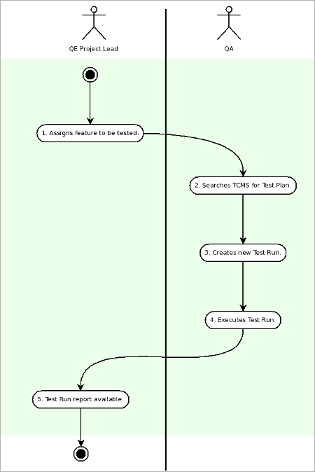
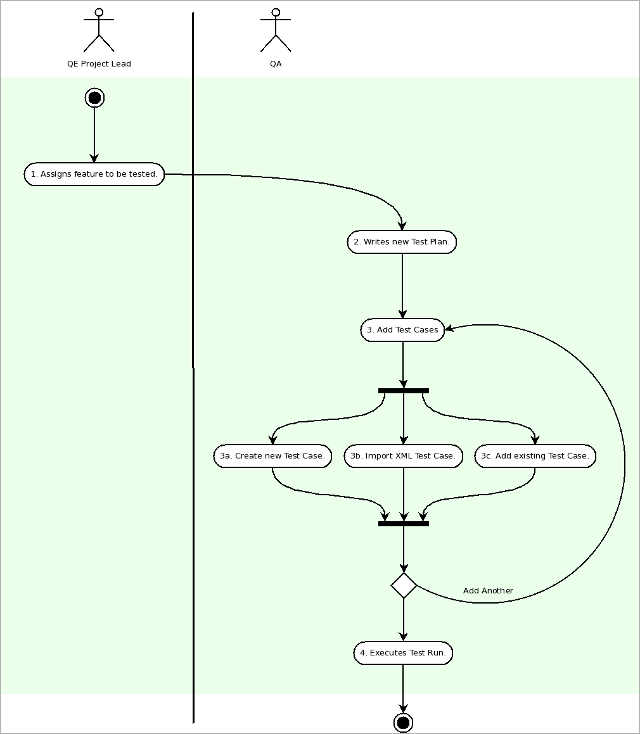
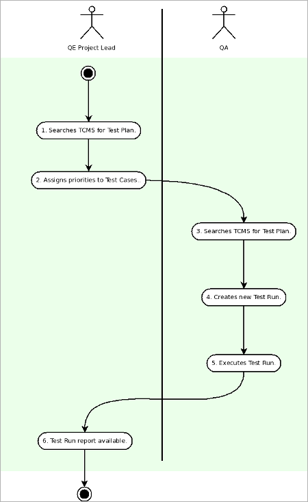
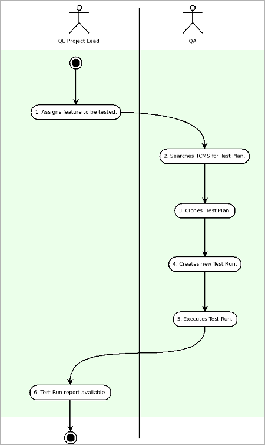

.. _usecase:

Use Cases
=========

The following Use Cases represent some common scenarios for using the
TCMS.

Manual Testing
--------------

The Manual Testing use case is:

#. QE Project / Team Lead assigns feature to be tested.
#. QA searches TCMS for Test Plan. See the section Searching for Test
   Plans.
#. QA creates new Test Run. See the section Creating a Test Run.
#. QA Executes Test Run. See the section Executing a Test Run.
#. Test Run report available for viewing. See the section Generating a
   Test Run report.

|Manual Testing Use Case.|

Writing a Test Plan
-------------------

The Writing a Test Plan use case is:

#. QE Project / Team Lead assigns feature to be tested.
#. QA writes a new Test Plan. See the section Creating a Test Plan.
#. QA adds Test Cases:

   #. Create new Test Case. See the section Creating a Test Case.
   #. Import XML Test Case. See the section Importing a Test Case.
   #. Add existing Test Case. See the section Using an existing Test
      Case.

#. QA Executes Test Run. See the section Executing a Test Run.

|Writing a Test Plan Use Case.|

PM Reporting
------------

The Project Manager use case is:

#. PM assigns searches for a Test Plan. See the section Searching for
   Test Plans.
#. PM assigns priorities to Test Cases. See the section Editing a Test
   Case.
#. QA searches TCMS for Test Plan. See the section Searching for Test
   Plans.
#. QA creates new Test Run. See the section Creating a Test Run.
#. QA Executes Test Run, based on Test Case priorities. See the section
   Executing a Test Run.
#. Test Run report available for viewing. See the section Generating a
   Test Run report.

|PM Reporting Use Case.|

Cloning a Test Plan
-------------------

The Cloning a Test Plan use case is:

#. QE Project / Team Lead assigns feature to be tested in new version of
   product.
#. QA searches TCMS for Test Plan. See the section Searching for Test
   Plans.
#. QA clones Test Plan. See the section Cloning a Test Plan.
#. QA creates new Test Run. See the section Creating a Test Run.
#. QA Executes Test Run. See the section Executing a Test Run.
#. Test Run report available for viewing. See the section Generating a
   Test Run report.

|Cloning a Test Plan Use Case.|

