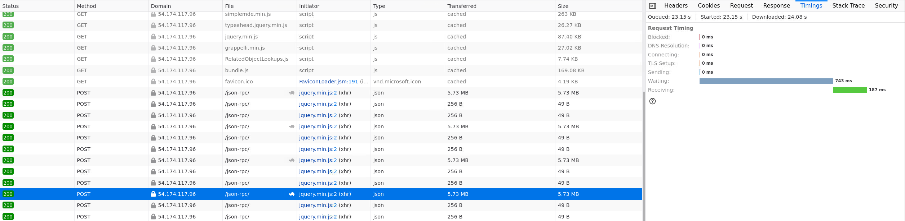

Hardware and performance
========================

Kiwi TCMS is predominantly an I/O driven application where disk latency
is more important than CPU performance and memory speed. This chapter
documents our experiments and findings to establish a baseline against
which administrators can plan their deployments.

Hardware requirements
---------------------

In its default configuration Kiwi TCMS runs a web application and
a database server as containers on the same hardware.

- **Minimum**: 1 CPU, 1 GiB memory:
  `t2.micro <https://aws.amazon.com/ec2/instance-types/>`_ AWS instance
  works but runs at >90% memory utilization and risks unnecessary swapping
  and/or going out of memory! If you need to be on the low end use *t2.small*
  or *t3.small* instance
- **Recommended**: 2 CPU, 4 GiB memory: the Kiwi TCMS team has had positive
  experience running on
  `t2.medium and t3.medium <https://aws.amazon.com/ec2/instance-types/>`_
  AWS instances

.. note::

    We've seen satisfactory performance with the default disk volume settings for
    AWS instances:
    `EBS-optimized <https://docs.aws.amazon.com/AWSEC2/latest/UserGuide/ebs-optimized.html>`_,
    `General Purpose SSD (gp2) <https://docs.aws.amazon.com/AWSEC2/latest/UserGuide/ebs-volume-types.html#solid-state-drives>`_,
    `100/3000 IOPS <https://docs.aws.amazon.com/AWSEC2/latest/UserGuide/ebs-io-characteristics.html>`_
    block storage. This is without any Linux filesystem related tweaks or
    changes to the default storage configuration of Docker Engine!

Write APIs execution speed
--------------------------

The various API methods in Kiwi TCMS will have vastly different execution
speeds.
Telemetry and search for example query tons of information from the database
while browsing pages and reporting results uses less queries. A question that
we often hear is *How many test execution results can Kiwi TCMS deal with?*

.. important::

    The information below has been gathered by using the following environment:

    - Client: AWS t3.medium in us-east-1a (same availability zone as server)
    - Server: AWS t3.medium in use-east-1a, 30GB gp3 disk, defaults to 3000 IOPS,
      default throughput 125 MiB/s
    - Kiwi TCMS v14.0 via ``docker compose up``
    - Database is ``mariadb:11.6.2`` with a persistent volume backed onto
      the host filesystem
    - Host OS - Ubuntu 24.04, freshly provisioned, no changes from defaults
    - ``api_write_test.py`` @
      `748787a <https://github.com/kiwitcms/Kiwi/blob/748787ad37702ed4df2554330eef987ec40268b8/tests/performance/api_write_test.py>`_
      with ``RANGE_SIZE=100``;
      ``locust --users 1 --spawn-rate 1 --run-time 60m --locustfile api_write_test.py``
    - For each invocation ``api_write_test.py`` creates new *Product*, *Version*
      *Build* and *TestPlan*. Test plan contains ``RANGE_SIZE x test cases`` then
      ``RANGE_SIZE x test runs``, each containing the previous test cases and finally
      updating results for all of them. This simulates a huge test matrix against
      the same test plan/product/version/build, e.g. testing on multiple different
      platforms (browser versions + OS combinations for example)
    - The total number of test execution results is ``RANGE_SIZE^2``
    - The total number of API calls is ``10 + 3*RANGE_SIZE + 2*RANGE_SIZE^2``
    - Single client, no other server load in parallel

    For ``RANGE_SIZE=100`` we've got ``10000`` test execution results and
    ``20310`` API calls in a single script invocation!

The results we've got are:

- 92000+ API calls/hour
- 45000+ test executions recorded/hour
- 25+ requests/second
- 33 ms/request (average); 73 ms/request (95%)
- 0 requests failed

|t3.medium metrics|
|t3.medium locust graph|
|t3.medium locust table|

.. important::

    Using a vanilla ``postgres:17.2`` as the database container resulted in worse
    performance out of the box. For the same CPU/system load we saw numbers which
    were only 60% of the ones reported above. Bombarding Kiwi TCMS with 2 Locust
    users resulted in comparable outcome at the expense of CPU load averaging 90%
    on the same hardware! This is due to several factors in the application framework:

    - More rigorous constraint checking in Postgres
    - Postgres is good at handling "long connections" while
      MariaDB is better at handling "short connections"
    - Connecting to Postgres is slower than connecting to a MariaDB
      (think process vs. thread)
    - Missing DB connection pooling as part of the application
      framework until very recently
    - Possibly Postgres performing more data analysis & optimization behind the
      scenes

    Aside from involving a DBA to monitor and tailor the performance of your
    Postgres database to match the behavior of Kiwi TCMS there is little we can
    do about it!

.. important::

    In the past (v12.0) we've also experimented with an *i3.large* storage optimized instance which has a
    Non-Volatile Memory Express (NVMe) SSD-backed storage optimized for low latency and
    very high random I/O performance. We've had to
    ``mkfs.xfs /dev/nvme0n1 && mount /dev/nvme0n1 /var/lib/docker`` before starting the
    containers.

    While you can see that ``nvme`` disk latency is an
    order of magnitude faster (< 0.1 ms) with the occasional peak from the root filesystem
    the overall application performance didn't change a lot. The times for ``RANGE_SIZE=30`` improved
    but the times for ``RANGE_SIZE=100`` worsened a bit.

    |i3.large metrics|

    This means few things:

    1) The presented metrics above are generally representative and you can use them
       to plan your deployment
    2) Going overboard on hardware, especially disk performance isn't necessary
    3) Somewhere else in Kiwi TCMS there is a bottleneck which we're
       still to investigate and improve! Pull requests and more profiling information are
       welcome.

    Upon further investigation we devised two additional scripts to aid in discovering possible
    bottlenecks:

    - `perf-script-orm <https://github.com/kiwitcms/api-scripts/blob/master/perf-script-org>`_
      which talks directly to the ORM layer simulating comparable number of DB operations
    - `perf-script-static <https://github.com/kiwitcms/api-scripts/blob/master/perf-script-static>`_
      which simulates the same number of API requests without touching the database.
      This can be used as a rough estimate of how much time is spent during web/API handling
    - During experiments with these two scripts CPU, Network and Disk metrics remained
      similar to previous executions which supports the theory of bottleneck in the application
      instead of hardware or operating system.

    Results against the same server with ``R=100`` yielded the following:

    1) 1120 sec for ``perf-script-ng``
    2) 234 sec for ``perf-script-orm``
    3) 333 sec for ``perf-script-static``

    Which translates as:

    1) 20% of the time is spent in ORM/DB operations
    2) 30% of the time is spent in the web/API stack
    3) 50% of the time is spent in additional computation for each API function, e.g.

       - permissions check
       - input validation
       - fetching objects by id
       - calculating sortkey and/or test run completion status
       - serialization

    Each API function has its own individuality but the biggest contenders in this case seem to be
    ``TestRun.add_case`` and ``TestExecution.update``. However more profiling information for every API
    function is needed in order to make a final verdict.

Read APIs execution speed
-------------------------

To establish a baseline for read APIs we've chosen the ``TestCase.filter`` and
``TestRun.filter`` methods which are used in the search pages. The experiment
is performed inside the following environment:

- Client is *t3.small* AWS instance
- Server is *t3.medium* AWS instance
- Both client and server are located in the *us-east-1a* region in AWS
- Result size for both methods is 10000 records serialized as JSON
- Search page was loaded and then the *Search* button was pressed additional
  times for a total of 5 executions

The results are as follow:

- ``TestCase.filter``: min 725 ms, max 930 ms for 5.73 MB data

  |TestCase.filter metrics|

  |TestCase.filter slowest info|

- ``TestRun.filter``: min 560 ms, max 921 ms for 5.16 MB data

  |TestRun.filter metrics|

  |TestRun.filter slowest info|

In the case where the client is across the world reaching the server through
the Internet the timings are quite different with most of the time being taken
to transfer the actual information:

|TestCase.filter metrics via Internet|

.. important::

    Firefox timing metrics are explained in
    `Mozilla's documentation <https://developer.mozilla.org/en-US/docs/Tools/Network_Monitor/request_details#timings_tab>`_

Parallel user sessions performance
----------------------------------

Another important question is *How many parallel users can Kiwi TCMS support?*
and the answer to this question is heavily dependent on what these users are
actually doing and how they are interacting with the application which is
vastly different between various teams and organizations.

To help answer this question we've created the ``web_simulation_test.py`` script
which uses the Playwright to simulate realistic user activity as if it was
from a browser. The script implements the top 10 most common activities such as
viewing the dashboard page, creating test plans and test cases and reporting
execution tesults in test runs. These actions and their frequency were created
using our `anonymous analytics metrics <https://kiwitcms.org/privacy/>`_!
Implementation includes random sleep and varying number of artifacts to
simulate a plausible human interaction. In all scenarios pages were left to
load and exercise their default JavaScript actions - for example search pages
will query and fully load all the results!

.. important::

    The information below has been gathered by using the following environment:

    - Client: AWS c6a.metal (192 CPU core) in us-east-1a (same availability zone as server)
    - Server: AWS t3.medium in use-east-1a, 30GB gp3 disk, defaults to 3000 IOPS,
      default throughput 125 MiB/s
    - Kiwi TCMS v14.0 via ``docker compose up``
    - Database is ``mariadb:11.6.2`` with a persistent volume backed onto
      the host filesystem
    - Host OS - Ubuntu 24.04, freshly provisioned, no changes from defaults
    - ``web_simulation_test.py`` @
      `87dd61f <https://github.com/kiwitcms/Kiwi/blob/87dd61ff9955e79de4604259bc29ab7a923f0730/tests/performance/web_simulation_test.py>`_
      ``locust --processes -1 --users 300 --spawn-rate 0.33 --run-time 60m --locustfile web_simulation_test.py``
    - ~ 15 min ramp-up of all users; then steady load
    - Existing state: 20 x TestPlan; 200 x TestCase; 200 x TestRun

The results we've got are:

- 300 users were served with minimum errors; < 0.01% of all requests
- Errors occured 2 mins before the end of the testing session; could also be
  related to other processes in the host OS eating up available CPU
- Cloning (usually more than 1 TC) is the heaviest operation; followed by
  login and creating a new TR
- Performance for individual pages must be analyzed separately
- Median response time is relatively stable
- 95th percentile response time graph contains occasional spikes
- We've seen more spikes when the ramp-up period is shorter
- RAM usage is relatively constant; stayed < 1 GiB
- CPU load is between 20-60%

|300 users t3.medium datadog|
|300 users t3.medium locust graph|
|300 users t3.medium locust graph fails|
|300 users t3.medium locust table|
|300 users t3.medium locust table fails|

.. important::

    Using a vanilla ``postgres:17.2`` as the database container resulted in similar
    outcome with very small differences (also remember the simulation itself contains
    an element of randomness):

    - 0 requests failed
    - Slightly higher requests/second served on average
    - Median response time for every individual request is slightly longer
      as pointed out above
    - Slightly more frequent spikes on the 95th percentile response time graph
    - CPU load is between 40-80%

.. |i3.large metrics| image:: ./_static/i3.large_nvme_r100.png

.. |TestCase.filter metrics via Internet| image:: ./_static/TestCase.filter_metrics_via_internet.png

.. |TestRun.filter slowest info| image:: ./_static/TestRun.filter_slowest_info.png

.. |300 users t3.medium locust table fails| image:: ./_static/300usr_t3.medium_gp3_locust_table_fails.png
