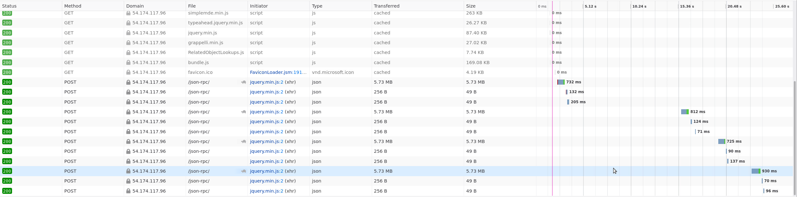

Hardware and performance
========================

Kiwi TCMS is predominantly an I/O driven application where disk latency
is more important than CPU performance and memory speed. This chapter
documents our experiments and findings to establish a baseline against
which administrators can plan their deployments.

Hardware requirements
---------------------

In its default configuration Kiwi TCMS runs a web application and
a database server as containers on the same hardware.

- **Minimum**: 1 CPU, 1 GiB memory:
  `t2.micro <https://aws.amazon.com/ec2/instance-types/>`_ AWS instance
  works but runs at >90% memory utilization and risks unnecessary swapping
  and/or going out of memory! If you need to be on the low end use *t2.small*
  or *t3.small* instance
- **Recommended**: 2 CPU, 4 GiB memory: the Kiwi TCMS team has had positive
  experience running on
  `t2.medium and t3.medium <https://aws.amazon.com/ec2/instance-types/>`_
  AWS instances

.. note::

    We've seen satisfactory performance with the default disk volume settings for
    AWS instances:
    `EBS-optimized <https://docs.aws.amazon.com/AWSEC2/latest/UserGuide/ebs-optimized.html>`_,
    `General Purpose SSD (gp2) <https://docs.aws.amazon.com/AWSEC2/latest/UserGuide/ebs-volume-types.html#solid-state-drives>`_,
    `100/3000 IOPS <https://docs.aws.amazon.com/AWSEC2/latest/UserGuide/ebs-io-characteristics.html>`_
    block storage. This is without any Linux filesystem related tweaks or
    changes to the default storage configuration of Docker Engine!

Write APIs execution speed
--------------------------

The various API methods in Kiwi TCMS will have vastly different execution
speeds.
Telemetry and search for example query tons of information from the database
while browsing pages and reporting results uses less queries. A question that
we often hear is *How many test execution results can Kiwi TCMS deal with?*

.. important::

    The information below has been gathered by using the following environment:

    - Client: t2.small in us-east-1a (same availability zone as server)
    - Server: t3.medium in use-east-1a, 30GB gp2 disk with 100 IOPS
    - Kiwi TCMS v12.0 via ``docker-compose up``
    - Database is ``mariadb:10.10.2`` with a persistent volume backed onto
      the host filesystem
    - Host OS - Amazon Linux, freshly provisioned, no changes from defaults
    - ``perf-script-ng`` version
      `fd942d9 <https://github.com/kiwitcms/api-scripts/blob/fd942d9f805900473b69171d4dada6605ea37a97/perf-script-ng>`_
      with ``RANGE_SIZE=100`` (called ``R`` below)
    - For each invocation ``perf-script-ng`` creates new *Product*, *Version*
      *Build* and *TestPlan*. Test plan contains ``R x test cases`` then
      ``R x test runs``, each containing the previous test cases and finally
      updating results for all of them. This simulates a huge test matrix against
      the same test plan/product/version/build, e.g. testing on multiple different
      platforms (browser versions + OS combinations for example)
    - The total number of test execution results is ``R^2``
    - The total number of API calls is ``10 + 3R + 2R^2``
    - Single client, no other server load in parallel

    For ``R=100`` we've got ``10000`` test execution results and
    ``20310`` API calls in a single script invocation!

The average results are:

- 43000 test execution results/hour
- 90000 API calls/hour
- 25 requests/second
- 40 ms/request

|t3.medium metrics|

.. important::

    We've experimented with an *i3.large* storage optimized instance which has a
    Non-Volatile Memory Express (NVMe) SSD-backed storage optimized for low latency and
    very high random I/O performance. We've had to
    ``mkfs.xfs /dev/nvme0n1 && mount /dev/nvme0n1 /var/lib/docker`` before starting the
    containers.

    While you can see that ``nvme`` disk latency is an
    order of magnitude faster (< 0.1 ms) with the occasional peak from the root filesystem
    the overall application performance didn't change a lot. The times for ``R=30`` improved
    but the times for ``R=100`` worsened a bit.

    |i3.large metrics|

    This means few things:

    1) The presented metrics above are generally representative and you can use them
       to plan your deployment
    2) Going overboard on hardware, especially disk performance isn't necessary
    3) Somewhere else in Kiwi TCMS there is a bottleneck which we're
       still to investigate and improve! Pull requests and more profiling information are
       welcome.

    Upon further investigation we devised two additional scripts to aid in discovering possible
    bottlenecks:

    - `perf-script-orm <https://github.com/kiwitcms/api-scripts/blob/master/perf-script-org>`_
      which talks directly to the ORM layer simulating comparable number of DB operations
    - `perf-script-static <https://github.com/kiwitcms/api-scripts/blob/master/perf-script-static>`_
      which simulates the same number of API requests without touching the database.
      This can be used as a rough estimate of how much time is spent during web/API handling
    - During experiments with these two scripts CPU, Network and Disk metrics remained
      similar to previous executions which supports the theory of bottleneck in the application
      instead of hardware or operating system.

    Results against the same server with ``R=100`` yielded the following:

    1) 1120 sec for ``perf-script-ng``
    2) 234 sec for ``perf-script-orm``
    3) 333 sec for ``perf-script-static``

    Which translates as:

    1) 20% of the time is spent in ORM/DB operations
    2) 30% of the time is spent in the web/API stack
    3) 50% of the time is spent in additional computation for each API function, e.g.

       - permissions check
       - input validation
       - fetching objects by id
       - calculating sortkey and/or test run completion status
       - serialization

    Each API function has its own individuality but the biggest contenders in this case seem to be
    ``TestRun.add_case`` and ``TestExecution.update``. However more profiling information for every API
    function is needed in order to make a final verdict.

Read APIs execution speed
-------------------------

To establish a baseline for read APIs we've chosen the ``TestCase.filter`` and
``TestRun.filter`` methods which are used in the search pages. The experiment
is performed inside the following environment:

- Client is *t3.small* AWS instance
- Server is *t3.medium* AWS instance
- Both client and server are located in the *us-east-1a* region in AWS
- Result size for both methods is 10000 records serialized as JSON
- Search page was loaded and then the *Search* button was pressed additional
  times for a total of 5 executions

The results are as follow:

- ``TestCase.filter``: min 725 ms, max 930 ms for 5.73 MB data

  |TestCase.filter metrics|

  |TestCase.filter slowest info|

- ``TestRun.filter``: min 560 ms, max 921 ms for 5.16 MB data

  |TestRun.filter metrics|

  |TestRun.filter slowest info|

In the case where the client is across the world reaching the server through
the Internet the timings are quite different with most of the time being taken
to transfer the actual information:

|TestCase.filter metrics via Internet|

.. important::

    Firefox timing metrics are explained in
    `Mozilla's documentation <https://developer.mozilla.org/en-US/docs/Tools/Network_Monitor/request_details#timings_tab>`_

.. |t3.medium metrics| image:: ./_static/t3.medium_gp2_r100.png

.. |TestRun.filter metrics| image:: ./_static/TestRun.filter_metrics.png
.. |TestRun.filter slowest info| image:: ./_static/TestRun.filter_slowest_info.png
