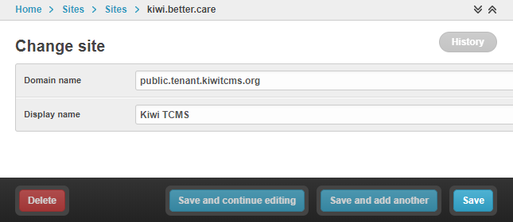

Running Kiwi TCMS as a Docker container
=========================================

In order to run Kiwi TCMS as a production instance you will need
`Docker <https://docs.docker.com/engine/installation/>`_ and
`docker-compose <https://docs.docker.com/compose/install/>`_ or equivalent tooling.
Refer to their documentation about download and installation options.

Start with Docker compose
-------------------------

For **Kiwi TCMS Community Edition** start by copying our
`docker-compose.yml <https://raw.githubusercontent.com/kiwitcms/Kiwi/master/docker-compose.yml>`_
file and make sure that all other files referenced inside of it are available
on your local filesystem!

For **Kiwi TCMS Enterprise** start by copying the
`docker-compose.testing <https://github.com/kiwitcms/enterprise/blob/master/docker-compose.testing>`_
file from the *kiwitcms/enterprise* git repository!

.. important::

    We recommend using the above files only as an example to
    create your own. This is what controls your Kiwi TCMS installation. It is
    best to keep your own copy under version control too!

Then you can start Kiwi TCMS by executing::

    cd path/to/your-docker-compose-git-repo/
    docker compose up -d

The above command will create two containers:

1) A web container based on the latest Kiwi TCMS image
2) A DB container based on the
   `official MariaDB <https://hub.docker.com/_/mariadb>`_
   image for *Kiwi TCMS Community Edition* or
   a DB container based on the
   `official PostgreSQL <https://hub.docker.com/_/postgres>`_
   image for *Kiwi TCMS Enterprise*. See https://kiwitcms.org/features/
   for a list of differences.

``docker compose`` will also create two volumes for persistent data storage:
``kiwi_db_data`` and ``kiwi_uploads``.

.. note::

    Kiwi TCMS container will bind to all network addresses on the system.
    To use it across the organization simply distribute the FQDN of the system
    running the Docker container to all associates.

.. warning::

    For *Kiwi TCMS Enterprise* the only way to serve the application is via a FQDN.
    Using IP addresses will not work! See
    https://github.com/kiwitcms/tenants/#dns-configuration
    for more information about DNS configuration for *Kiwi TCMS Enterprise*.

.. important::

    Database connection credentials can also be configured via Docker Secrets.
    Alternatively you may commit or mount arbitrary text files inside the container. In both
    cases you have to configure the absolute path to the file containing the actual value
    as an environment variable inside the running container. See
    `docker-compose.with-secrets <https://raw.githubusercontent.com/kiwitcms/Kiwi/master/docker-compose.with-secrets>`_
    for reference!

    For example:

    - ``KIWI_DB_PASSWORD: kiwi`` - Password will be "kiwi", specified as plain text
    - ``KIWI_DB_PASSWORD: /run/secret/db_password`` - Password will be read from
      the file ``/run/secret/db_password``. Docker Secrets must be configured accordingly
    - ``KIWI_DB_PASSWORD: /Kiwi/config/db_password.txt`` - Password will be read
      from the file ``/Kiwi/config/db_password.txt``. This file needs to be present
      inside the container: either burned into the container image or mounted via
      external volume

    .. warning::

        When an absolute path has been specified the file will be opened in text mode;
        UTF-8 encoding; Trailing newlines and/or white space will be stripped!

    .. warning::

        *Kiwi TCMS Enterprise* additionally supports database configuration via the
        ``DATABASE_URL`` environment variable, see
        `example <https://github.com/kiwitcms/enterprise/blob/master/docker-compose.testing>`_.
        If specified this configuration is applied **after** parsing of ``KIWI_DB_*`` variables
        and will override them!
        Don't use ``DATABASE_URL`` and ``KIWI_DB_*`` environment variables together!

    .. versionadded:: 11.4

.. important::

    Kiwi TCMS does not provide versioned docker images via Docker Hub, see
    https://kiwitcms.org/containers/ for more information!

Initial configuration of running container
------------------------------------------

You need to use the following command line tool to perform interactive initial
configuration of a new Kiwi TCMS installation **before** accessing the
application via a browser::

    docker exec -it kiwi_web /Kiwi/manage.py initial_setup

This command will create the necessary database structure, create a super-user
account and adjust internal settings as needed. Once complete you can access
your Kiwi TCMS instance via https://localhost (community edition) or
https://kiwi-tenants-domain (enterprise edition).

.. warning::

    In the command ``docker exec`` the option ``-i`` keeps STDIN open
    even if not attached while ``-t`` allocates a pseudo-TTY. They are suitable
    when executed on a terminal by a person. When used in automated scripts
    ``-t`` often needs to be removed! For more information about ``docker exec``
    see https://docs.docker.com/engine/reference/commandline/exec/#options

.. _upgrading-instructions:

Upgrading
---------

To upgrade running Kiwi TCMS containers execute the following commands::

    cd path/containing/docker-compose/
    docker compose down
    docker compose pull
    docker compose up -d
    docker exec -it kiwi_web /Kiwi/manage.py upgrade

.. warning::

    Always make sure that you execute ``upgrade`` and that it doesn't report
    any errors. This ensures that your database schema has been altered
    to match the structure which is expected by the latest version of Kiwi TCMS!
    After an upgrade is performed
    ``docker exec -it kiwi_web /Kiwi/manage.py showmigrations`` should always
    report that all migrations have been applied!

.. important::

    Version tagged and multi-arch `container images <https://kiwitcms.org/containers/>`_
    are available only to `Kiwi TCMS subscribers <https://kiwitcms.org/#subscriptions>`_!

.. note::

    Uploads and database data should stay intact because they are split into
    separate volumes which makes upgrading very easy. Always
    `backup <https://kiwitcms.org/blog/atodorov/2018/07/30/how-to-backup-docker-volumes-for-kiwi-tcms/>`_
    before upgrading!

Kiwi TCMS recommends that you test the upgrade on a staging server first
in order to minimize the risk of migration failures! You should pay special
attention to the DB section changelog entries for every release!

SSL configuration
-----------------

By default Kiwi TCMS is served via HTTPS. The connection is secured by a
self-signed certificate which if valid for 10 years and contains the
following properties::

    CN = container-layer-hash-id
    OU = Quality Engineering
    O = Kiwi TCMS
    L = Sofia
    C = BG

The certificate authority file is available at https://localhost/static/ca.crt!
You may distribute this file to all browsers who are going to access the
running Kiwi TCMS instance.

If you want to use different SSL certificate you need to update the
``localhost.key`` and ``localhost.crt`` files located under ``/Kiwi/ssl/`` or
bind-mount your own SSL directory to ``/Kiwi/ssl`` inside the docker container!

More information about generating your own self-signed certificates can be
found at https://github.com/sgallagher/sscg#full-usage.

.. warning::

    Kiwi TCMS will issue a warning if the connection is not secured by SSL!!!

    .. versionadded:: 10.4

Reverse proxy SSL
-----------------

Sometimes you may want to serve Kiwi TCMS behind a reverse proxy which will
also handle SSL termination. For example we serve https://public.tenant.kiwitcms.org,
https://tcms.kiwitcms.org and a few other instances through Nginx. For all of
these domains the browser will see a wildcard SSL certificate for
``*.kiwitcms.org``, while the individual docker containers are still configured
with the default self-signed certificate (that is the connection between
Nginx and the docker container)! Here's how the configuration looks like::

    http {
        # default ssl certificates for *.kiwitcms.org
        ssl_certificate     /etc/nginx/wildcard_kiwitcms_org.crt;
        ssl_certificate_key /etc/nginx/wildcard_kiwitcms_org.key;

        # default proxy settings
        proxy_set_header Host $host;
        proxy_set_header X-Real-IP $remote_addr;

        server {
            listen 8080;
            server_name public.tenant.kiwitcms.org;

            location / {
                return 301 https://$host$request_uri;
            }
        }

        server {
            server_name public.tenant.kiwitcms.org;
            listen 8443 ssl;

            location / {
                proxy_pass https://tenant_kiwitcms_org_web:8443;
            }
        }
    }

Here is an equivalent configuration for `HAProxy <https://www.haproxy.org/>`_::

    frontend front_http
        bind *:8080
        reqadd X-Forwarded-Proto:\ http
        redirect scheme https code 301

    frontend front_https
        # default ssl certificates for *.kiwitcms.org
        bind *:8443 ssl crt /etc/haproxy/ssl/
        reqadd X-Forwarded-Proto:\ https

        acl kiwitcms hdr(host) -i public.tenant.kiwitcms.org
        use_backend back_kiwitcms if kiwitcms

    backend back_kiwitcms
        http-request set-header X-Forwarded-Port %[dst_port]
        http-request add-header X-Forwarded-Proto https

        # some security tweaks
        rspadd Strict-Transport-Security:\ max-age=15768000
        rspadd X-XSS-Protection:\ 1;\ mode=block

        # do not verify the self-signed cert
        server kiwi_web tenant_kiwitcms_org_web:8443 ssl verify none

Enable plain text HTTP access
-----------------------------

Kiwi TCMS container always enforces HTTPS connections, by redirecting
HTTP (80) requests to HTTPS (443)!

.. warning::

    This behavior may no longer be deactivated via the
    ``KIWI_DONT_ENFORCE_HTTPS`` environment variable!

    .. versionremoved:: 12.0

Customization
-------------

You can override any default settings provided by ``tcms/settings/product.py``
by editing ``docker-compose.yml``:

* Mount the host file ``local_settings.py`` inside the running container under
  ``../tcms/settings/``::

        volumes:
            - uploads:/Kiwi/uploads
            - ./local_settings.py:/venv/lib64/python3.11/site-packages/tcms/settings/local_settings.py

  If this file exists it is imported before any of the files under
  ``tcms_settings_dir/``!

.. versionadded:: 8.1
.. versionchanged:: 8.2

* Mount multiple override .py files under
  ``../site-packages/tcms_settings_dir/``::

        volumes:
            - uploads:/Kiwi/uploads
            - ./my_settings_dir/email_config.py:/venv/lib64/python3.9/site-packages/tcms_settings_dir/email_config.py
            - ./my_settings_dir/multi_tenant.py:/venv/lib64/python3.9/site-packages/tcms_settings_dir/multi_tenant.py

  .. important::

        Filenames under ``my_settings_dir/`` must be valid Python
        `module names <https://www.python.org/dev/peps/pep-0008/#package-and-module-names>`_,
        in other words you should be able to import them!

        Modules under ``my_settings_dir/`` are sorted alphabetically before being imported!
        For a directory structure which lools like this::

            my_settings_dir/
            ├── django_social_auth.py
            ├── email_config.py
            ├── __init__.py
            └── multi_tenant.py

        the import order is ``django_social_auth``, ``email_config``, ``multi_tenant``!

        ``__init__.py`` is skipped but it must be present to indicate Python can import
        modules from this directory!

    .. important::

        Starting from Kiwi TCMS v8.2 the ``__init__.py`` file must contain::

            __path__ = __import__('pkgutil').extend_path(__path__, __name__)

        and nothing else if you want to mount the entire ``my_settings_dir`` directly!
        This is because ``tcms_settings_dir`` is now treated as a
        `pkgutil-style namespace package <https://packaging.python.org/guides/packaging-namespace-packages/#pkgutil-style-namespace-packages>`_
        and is provided by default when installing Kiwi TCMS! This allows plugins
        and downstream override packages to install settings files into this directory!

For more information about what each setting means see :ref:`configuration`.

.. warning::

    Some older versions of docker do not allow mounting of files between the
    host and the container, they only allow mounting directories and volumes.
    The stock docker versions on CentOS 7 and RHEL 7 do this. You may see an
    error similar to:

    ERROR: for kiwi_web Cannot start service web:
        OCI runtime create failed: container_linux.go:348:
            starting container process caused "process_linux.go:402:
                container init caused "rootfs_linux.go:58: mounting
                    "/root/kiwi/local_settings.py" to
                    rootfs "/var/lib/docker/overlay2 ....

    In this case you will either have to upgrade your docker version
    or ``COPY`` the desired files and rebuild the docker image!

Customized docker image
-----------------------

.. warning::

    Modifying the default ``Dockerfile`` directly is not recommended because
    it is kept under version control and will start conflicting the next time
    you do ``git pull``. It is also not a very good idea to deploy an image built
    directly from the master branch.

    The proper way to create a downstream docker image is to provide a
    ``Dockerfile.myorg`` which inherits ``FROM pub.kiwitcms.eu/kiwitcms/kiwi:latest``
    and adds your changes as separate layers! Ideally you will keep this into
    another git repository together with your build instructions and possibly a
    customized ``docker-compose.yml`` file.

Troubleshooting
----------------

The Kiwi TCMS container will print HTTPD logs on STDOUT!

.. warning::

    You must start the containers in the foreground with ``docker compose up``,
    e.g. without the ``-d`` option in order to see their logs or use
    ``docker container logs [-f|--tail 1000] kiwi_web``!

In case you see a 500 Internal Server Error page and the error log does not
provide a traceback you should configure the ``DEBUG`` setting to ``True`` and
restart the docker container. If your changes are picked up correctly you
should see an error page with detailed information about the error instead of
the default 500 error page.

When reporting issues please copy the relevant traceback as plain text into
your reports!

